# Detailed Design Document: Portable HDMI Streaming Device

**Version:** 2.0  
**Date:** February 2025  
**Status:** Final (Design Review & Enrichment)  
**Format:** Markdown  
**Audience:** Product, Test, Engineering, Compliance

---

## Table of Contents

1. [Executive Summary](#1-executive-summary)
2. [System Context](#2-system-context)
3. [Architecture Overview](#3-architecture-overview)
4. [Traceability Matrix](#4-traceability-matrix)
5. [Design Decisions Log](#5-design-decisions-log)
6. [Hardware Abstraction Layer Details](#6-hardware-abstraction-layer-hal-details)
7. [Software Architecture and Design](#7-software-architecture-and-design)
8. [Data Models and Schemas](#8-data-models-and-schemas)
9. [Interfaces and API Design](#9-interfaces-and-api-design)
10. [Data Flow and Sequence Diagrams](#10-data-flow-and-sequence-diagrams)
11. [Hardware Acceleration and Performance](#11-hardware-acceleration-and-performance)
12. [Security and Threat Modeling](#12-security-and-threat-modeling)
13. [Privacy and Telemetry Policy](#13-privacy-and-telemetry-policy)
14. [Non-Functional Requirements Mapping](#14-non-functional-requirements-mapping)
15. [Visual Consistency and Accessibility](#15-visual-consistency-and-accessibility)
16. [Testing Strategy and Plan](#16-testing-strategy-and-plan)
17. [Licensing and Compliance](#17-licensing-and-compliance)
18. [Build, CI/CD, and Release](#18-build-cicd-and-release)
19. [Compliance and Standards](#19-compliance-and-standards)
20. [Platform and Build Environment](#20-platform-and-build-environment)
21. [Testing and Validation](#21-testing-and-validation-legacy-reference)
22. [Deployment and Operations](#22-deployment-and-operations)
23. [Documentation and Deliverables](#23-documentation-and-deliverables)
24. [Risks and Mitigations](#24-risks-and-mitigations)
25. [Appendix and Glossary](#25-appendix-and-glossary)

---

## 1. Executive Summary

### 1.0 Quick Reference (Design Review)

This document is the **single source of truth** for product and test teams. It links PRD requirements to design artifacts, captures architectural decisions, defines data schemas, and specifies testable acceptance criteria. Use the [Design Review Checklist](Design_Review_Checklist.md) for audits.

*Acceptance criterion example:* The UI Service must render the home page and move focus to the next icon within 200 ms of receiving a NAV_RIGHT key event under normal load (mock HAL, <10 apps).

### 1.1 Product Overview

The **Portable HDMI Streaming Device** is a firmware-driven embedded system that connects to a TV via HDMI. It delivers a home-page launcher for streaming apps (Netflix, Prime Video, Hulu, Disney+), streams content over Wi-Fi, and supports control via remote, HDMI-CEC, and a companion mobile app over Bluetooth.

### 1.2 Goals

| Goal | Description |
|------|-------------|
| **Simplicity** | Plug-and-play HDMI connection; minimal user setup |
| **Unified Control** | Single remote for TV and device; CEC integration |
| **Streaming** | Wi-Fi delivery with TLS; multi-codec support |
| **Extensibility** | HAL and SOA architecture; swappable drivers |
| **Reliability** | Graceful error handling; OTA updates |

### 1.3 Target Hardware Platform

- **SoC**: ARM or RISC-V class; target: Cortex-A series or equivalent
- **Memory**: 256 MB RAM minimum; 512 MB recommended for 4K
- **Storage**: Flash for firmware; persistent config
- **Peripherals**: HDMI (1.4+), Wi-Fi, Bluetooth/BLE, IR receiver

### 1.4 Key Features

| Feature | Description |
|---------|-------------|
| **HDMI** | 1080p/4K video and audio passthrough |
| **HDMI-CEC** | Power, volume, navigation control of TV |
| **Wi-Fi** | Client for streaming; TLS for secure delivery |
| **Bluetooth** | A2DP audio; GATT control for mobile app |
| **Codecs** | H.265, AV1, VP9, MPEG-4, ProRes |
| **Containers** | MP4, MOV, MKV |
| **DRM** | HAL hooks for Widevine/PlayReady/FairPlay |

### 1.5 Core Use Cases

1. **Launch apps from home page** – Navigate with remote, select app icon, launch streaming session
2. **HDMI-CEC TV control** – Power on/off TV, volume, navigation passthrough
3. **Wi-Fi streaming** – Connect to network, stream from app content servers
4. **Bluetooth control** – Pair mobile app, send navigation and playback commands
5. **Mobile app integration** – Companion app for discovery, pairing, control

---

## 2. System Context

### 2.1 System Context Diagram

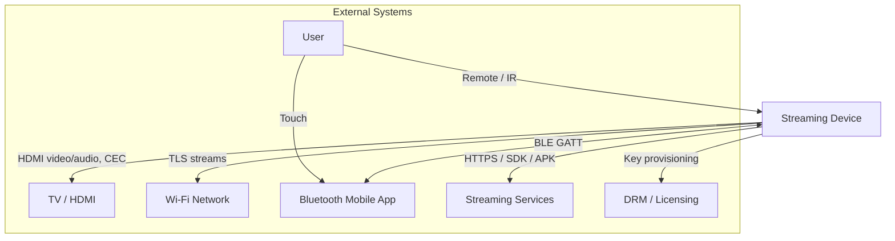

### 2.2 External Actors and Systems

| Actor/System | Interface | Description |
|--------------|-----------|-------------|
| **TV / HDMI** | HDMI Type A, CEC bus | Video/audio output; CEC command exchange |
| **Wi-Fi Network** | 802.11, TLS | Stream delivery, OTA updates |
| **Bluetooth Devices** | BLE GATT, A2DP | Mobile app control; audio sink |
| **Streaming Services** | HTTPS, SDK/APK | Netflix, Prime, Hulu, etc. content delivery |
| **DRM / Licensing** | Vendor APIs | Widevine, PlayReady; ProRes, HEVC licensing |

### 2.3 Interfaces to External Systems

| Interface | Protocol | Notes |
|-----------|----------|-------|
| **HDMI** | HDMI 1.4/2.0 spec | Video, audio, EDID; HDCP when required |
| **HDMI-CEC** | CEC 1.4 | User control codes, power, standby |
| **Wi-Fi** | 802.11n/ac, wpa_supplicant | TLS for streaming endpoints |
| **Bluetooth** | BLE 4.x+, GATT | Custom control service UUID |
| **Streaming SDKs** | HTTPS, vendor APIs | App-specific; auth, CDN |
| **DRM** | Vendor-specific | Key request/response, license tokens |

---

## 3. Architecture Overview

### 3.1 High-Level Architectural Diagram

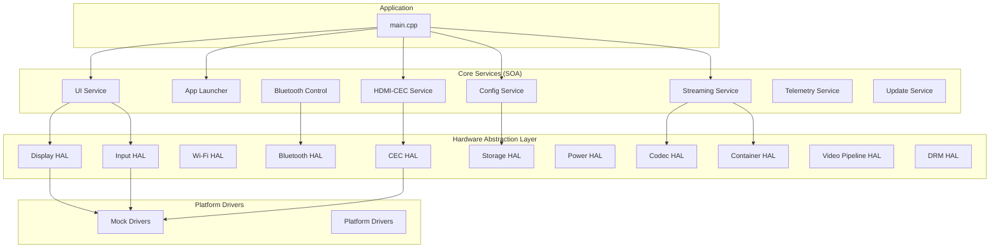

### 3.2 Layer Definitions

| Layer | Responsibility |
|-------|----------------|
| **Application** | Main loop, input routing, service orchestration |
| **Core Services (SOA)** | UI, app launch, streaming, CEC, config, telemetry, update |
| **Hardware Abstraction Layer** | Abstract interfaces; platform-independent APIs |
| **Platform Drivers** | Mock (test) or real hardware implementations |

### 3.3 Security and Compliance Layer

- **Secure boot** – Verified boot chain (platform-dependent)
- **Code signing** – Firmware signed; OTA verification
- **DRM** – Content protection via IDrmHal; key isolation

### 3.4 DRM / Content Protection Layer

- **IDrmHal** – Request keys, release session, content protection check
- **Hooks** – Integrate Widevine, PlayReady, FairPlay
- **Key isolation** – Secure storage; TEE where available

---

## 4. Traceability Matrix

Links each PRD requirement to design artifacts, verification method, owner, and status. Source: [Product_Requirements_Document.md](Product_Requirements_Document.md).

| Req ID | Description | Design Artifact | Verification Method | Owner | Status |
|--------|-------------|-----------------|---------------------|-------|--------|
| US-001 | HDMI connect; video/audio on TV | IDisplayHal, ResolutionInfo, EDID | H-DIS-001 to H-DIS-004 | HAL | Done |
| US-002 | HDMI-CEC powers TV | IHdmiCecHal::sendPowerOn, CEC service | H-CEC-001, I-001 | CEC | Done |
| US-003 | Remote volume via CEC | IHdmiCecHal::sendUserControl | H-CEC-002, I-003 | CEC | Done |
| US-004 | Home page with app icons | IUiService, layout.json | H-UI-001, H-UI-004 | UI | Done |
| US-005 | D-pad navigation, focus | IUiService::navigate, focus model | H-UI-002, H-UI-003 | UI | Done |
| US-006 | Launch Netflix/streaming app | IAppLauncherService, IStreamingService | H-APP-002, I-001 | App/Stream | Done |
| US-007 | Back exits app, return home | App lifecycle, Streaming stop | H-APP-003, I-002 | App | Done |
| US-008 | Wi-Fi connect | IWifiHal, IConfigService | R-WF-001, H-CFG-001 | HAL/Config | Done |
| US-009 | H.265/HEVC, HDR | ICodecDecoder, IVideoPipeline, HdrMetadata | H-CODEC-003, H-PIPE-002 | Codec | Done |
| US-010 | AV1, VP9 support | ICodecDecoder, CodecCapabilities | H-CODEC-002, H-CODEC-004 | Codec | Done |
| US-011 | MP4, MOV, MKV | IContainerParser, ContainerService | H-CON-001 to H-CON-004 | Container | Done |
| US-012 | Bluetooth pair | IBluetoothHal, BLE GATT | H-BT-001, H-BT-003 | BT | Done |
| US-013 | Mobile nav commands | Bluetooth Control, Command 0x01-0x06 | I-004, H-BT-003 | BT | Done |
| US-014 | Mobile play/pause | Command 0x07, 0x08 | H-STR-002, H-STR-003 | Stream | Done |
| US-015 | Power → TV standby | IHdmiCecHal::sendStandby | H-CEC-003 | CEC | Done |
| US-016 | Settings persist | IStorageHal, IConfigService | H-CFG-001 to H-CFG-003 | Config | Done |
| US-017 | OTA updates | IUpdateService, signed image | Security §12.2 | Update | Done |
| US-018 | TLS streams | Network layer, wpa_supplicant | Security §12 | Network | Done |
| US-019 | Seek in video | IContainerParser::seek, StreamPipeline | H-PIPE-003 | Pipeline | Done |
| US-020 | Multi-track, subtitles | TrackMetadata, getTracks | H-CON-002 | Container | Done |
| US-021 | Network error handling | Buffer underrun, retry logic | R-STRM-001, R-STRM-002 | Stream | Done |
| US-022 | Wake-on-remote | IPowerHal, IInputHal | Integration | Power | Done |
| US-023 | Mute via remote | IHdmiCecHal::sendUserControl | H-CEC-002 | CEC | Done |
| US-024 | A2DP audio sink | IBluetoothHal (A2DP) | Manual/HiL | BT | Planned |
| US-025 | HAL, mock drivers | All IHAL interfaces | All H-*, R-* | Architecture | Done |
| US-026 | Test cases documented | Test_Suite_Document.md | Ctest pass | Test | Done |
| US-027 | Build instructions | guides/build-and-run.md | `make test` | DevEx | Done |
| US-028 | HDMI setup docs | guides/hdmi-setup.md | Manual review | Docs | Done |

---

## 5. Design Decisions Log

For each major architectural choice: problem, alternatives, chosen solution, rationale, risks, date, owner.

| ID | Statement of Problem | Alternatives Considered | Chosen Solution | Rationale | Risks/Mitigations | Date | Owner |
|----|----------------------|-------------------------|-----------------|-----------|-------------------|------|-------|
| DD-001 | How to abstract hardware for portability? | Monolithic firmware; minimal abstraction | **HAL with IHAL interfaces** | Swap mock/real drivers; unit-test without HW; multi-SoC support | Risk: Overhead. Mit: Lean interfaces, no virtual calls in hot path | Feb 2025 | Arch |
| DD-002 | How to structure application services? | Single process; microservices | **SOA with 8 core services** | Clear boundaries; event bus for decoupling; testable modules | Risk: Complexity. Mit: Documented contracts, IDL draft | Feb 2025 | Arch |
| DD-003 | How to handle video decode across SoCs? | SW-only; HW-only | **ICodecDecoder with HW toggle** | HW preferred; SW fallback; platform drivers implement | Risk: Format gaps. Mit: getCapabilities(), capability checks | Feb 2025 | Media |
| DD-004 | How to support DRM without vendor lock-in? | Hard-code Widevine; no DRM | **IDrmHal abstraction** | Vendor-specific drivers; Widevine/PlayReady/FairPlay hooks | Risk: Integration complexity. Mit: HAL contract, key isolation | Feb 2025 | Security |
| DD-005 | Remote control: IR, CEC, Bluetooth? | IR only; separate paths | **Unified Input HAL + routing** | IInputHal normalizes; main routes to CEC or app; single focus model | Risk: Latency. Mit: <200 ms target, async where needed | Feb 2025 | Input |
| DD-006 | No exceptions across HAL? | C++ exceptions; error codes | **Result enum, no exceptions** | Embedded; deterministic; predictable stack | Risk: Boilerplate. Mit: Result helpers, macros | Feb 2025 | HAL |
| DD-007 | OTA update strategy? | In-place; A/B slots | **Signed image, verify before apply; A/B where supported** | Security; rollback on failure; platform-dependent slots | Risk: Brick. Mit: Fallback image, verified boot | Feb 2025 | Update |
| DD-008 | Mobile app control protocol? | HTTP; raw sockets | **BLE GATT, custom service UUID** | Low power; standard stack; pairing/bonding | Risk: Interop. Mit: Bluetooth SIG compliance, documented protocol | Feb 2025 | BT |

---

## 6. Hardware Abstraction Layer (HAL) Details

### 6.1 HAL Domains and API Surface

| HAL | Interface | Key Methods | Data Models |
|-----|-----------|-------------|-------------|
| **Display** | IDisplayHal | initialize, setDisplayMode, getFramebuffer, present, clear | ResolutionInfo, framebuffer |
| **Input** | IInputHal | initialize, poll, injectKey, setInputCallback | InputEvent, RemoteKey |
| **Wi-Fi** | IWifiHal | connect, disconnect, getState, resolveHost | WifiState |
| **Bluetooth** | IBluetoothHal | initialize, registerControlService, writeCharacteristic | BluetoothState |
| **HDMI-CEC** | IHdmiCecHal | sendPowerOn, sendStandby, sendUserControl, sendRemoteKey | CecMessage, CecUserControlCode |
| **Storage** | IStorageHal | read, write, exists, remove | Key-value strings |
| **Power** | IPowerHal | sleep, wake, getBatteryLevel | - |
| **Audio** | IAudioHal | setVolume, mute | - |
| **Codec** | ICodecDecoder | initialize, decodeFrame, flush, reset | DecodedFrame, EncodedPacket |
| **Container** | IContainerParser | openContainer, readPacket, seek, getTracks | TrackMetadata, EncodedPacket |
| **Video Pipeline** | IVideoPipeline | submitFrame, setOutputColorSpace, setHdrMetadata | DecodedFrame |
| **DRM** | IDrmHal | requestKeys, releaseSession, isContentProtected | - |

### 6.2 Error Handling Strategy

- **Result enum** – `device::Result::OK`, `ERROR_INVALID_PARAM`, `ERROR_IO`, etc.
- **No exceptions** – APIs return Result; callers check and handle
- **Recovery** – State rollback on failure; pipeline flush/reset on decode errors

### 6.3 State Diagrams

#### 6.3.1 Initialization State

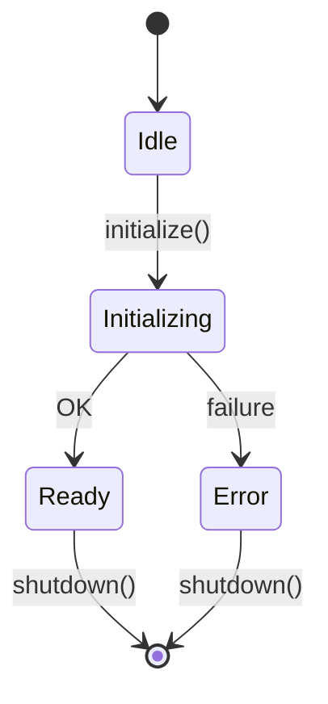

#### 6.3.2 Stream Pipeline State

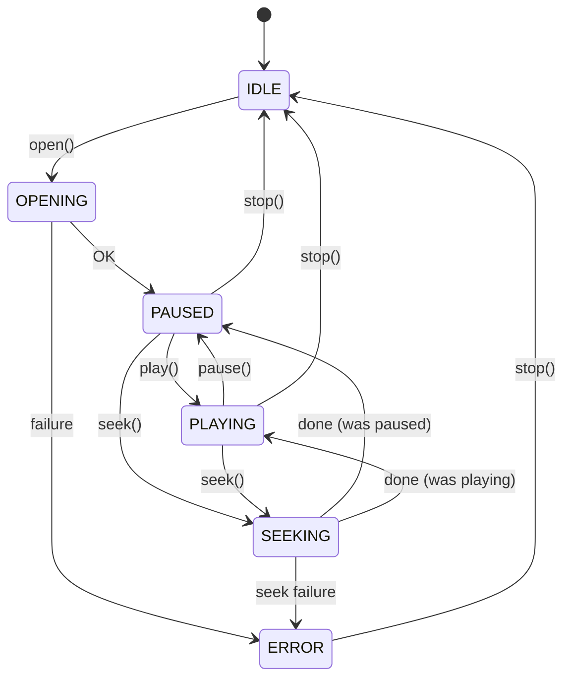

#### 6.3.3 Power Management

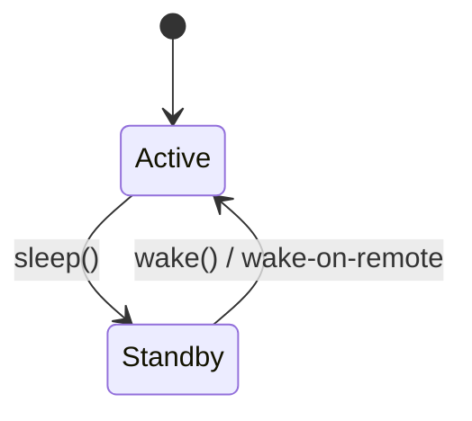

---

## 7. Software Architecture and Design

### 7.1 Service-Oriented Architecture (SOA)

#### 7.1.1 Core Services

| Service | Responsibility | Interface |
|---------|----------------|-----------|
| **UI Service** | Launcher, home page rendering, navigation | IUiService |
| **App Launcher** | App registry, launch, lifecycle | IAppLauncherService |
| **Streaming Service** | Pipeline orchestration, session management | IStreamingService |
| **HDMI-CEC Service** | Key mapping, CEC command generation | IHdmiCecService |
| **Bluetooth Control** | Mobile app command handling | IBluetoothControlService |
| **Config Service** | Persistent settings | IConfigService |
| **Telemetry** | Logging, metrics | ITelemetryService |
| **Update** | OTA workflow | IUpdateService |

#### 7.1.2 Inter-Service Communication

| Mechanism | Usage |
|-----------|-------|
| **Event Bus** | APP_LAUNCHED, APP_STOPPED; decoupled publish/subscribe |
| **Synchronous calls** | Direct service-to-service (e.g., main → CEC, UI → launcher) |
| **Callbacks** | Status, telemetry, input events |

### 7.2 Modules and Responsibilities

| Module | Responsibility |
|--------|----------------|
| **UI Service** | Focus model, D-pad navigation, accessibility-ready design |
| **App Launcher** | App catalog from config; auth hooks; session lifecycle |
| **Streaming Service** | Pipeline open/play/pause/seek; buffering; error recovery |
| **HDMI/CEC Manager** | RemoteKey → CecUserControlCode; TV state sync |
| **Bluetooth Control** | GATT Command/Status; pairing; control channel protocol |
| **Network/Streaming** | TLS, content delivery, DRM licensing, QoS |
| **Update and Telemetry** | Secure OTA; log collection; metrics |

### 7.3 Data Models (Summary)

See [§8 Data Models and Schemas](#8-data-models-and-schemas) for formal definitions. Quick reference: **AppMetadata**, **TrackMetadata**, **StreamingSession**, **HdrMetadata**.

---

## 8. Data Models and Schemas

Formal definitions with types, required/optional fields, and validation rules. See also `include/streaming_device/types.hpp`, `include/streaming_device/media_types.hpp`, and [schemas/streaming_device_schemas.json](schemas/streaming_device_schemas.json).

### 8.1 AppMetadata

| Field | Type | Required | Validation | Description |
|-------|------|----------|------------|-------------|
| id | string | Yes | Non-empty, `^[a-z0-9_-]+$` | App identifier (e.g., `netflix`) |
| name | string | Yes | 1–64 chars | Display name |
| icon_path | string | No | Valid path or URI | Icon asset path |
| package_uri | string | No | URI format | App bundle or web URL |
| auth_endpoint | string | No | URI format | OAuth/auth URL |
| requires_auth | boolean | No | — | Default false |

*Acceptance:* `launch(app_id)` with valid AppMetadata returns `AppLaunchStatus::SUCCESS` within 2 s.

### 8.2 TrackMetadata

| Field | Type | Required | Validation | Description |
|-------|------|----------|------------|-------------|
| type | enum (VIDEO\|AUDIO\|SUBTITLE) | Yes | — | Track type |
| track_id | uint32 | Yes | > 0 | Track index |
| language | string | No | ISO 639-1 | Language code |
| duration_us | int64 | No | ≥ 0 | Duration microseconds |
| bitrate | int64 | No | ≥ 0 | Bits per second |
| video | VideoTrackInfo | When type=VIDEO | — | Codec, width, height, HDR |
| audio | AudioTrackInfo | When type=AUDIO | — | Codec, sample_rate, channels |
| subtitle | SubtitleTrackInfo | When type=SUBTITLE | — | Language, is_forced |

### 8.3 StreamingSession

| Field | Type | Required | Validation | Description |
|-------|------|----------|------------|-------------|
| app_id | string | Yes | Non-empty | Source app |
| session_id | string | Yes | Non-empty | Unique session |
| state | enum | Yes | IDLE\|PLAYING\|PAUSED\|SEEKING\|ERROR | Current state |

### 8.4 HdrMetadata

| Field | Type | Required | Validation | Description |
|-------|------|----------|------------|-------------|
| color_primaries | enum | No | BT709, BT2020, etc. | ITU-T H.273 |
| transfer | enum | No | BT709, SMPTE_2084, HLG | Transfer characteristics |
| matrix | enum | No | BT709, BT2020_NCL | Matrix coefficients |
| mastering_display | MasteringDisplayInfo | No | — | SMPTE ST 2086 |
| content_light | ContentLightLevel | No | MaxCLL, MaxFALL | Content light levels |
| is_hdr10 | boolean | No | — | HDR10 flag |
| is_hlg | boolean | No | — | HLG flag |

### 8.5 Layout Configuration (layout.json)

Sample schema for home page layout. Used by UI Service.

```json
{
  "version": 1,
  "initialFocusIndex": 0,
  "icons": [
    {"id": "netflix", "label": "Netflix", "asset": "assets/icons/netflix.svg", "isNetwork": false},
    {"id": "prime", "label": "Prime Video", "asset": "assets/icons/prime_video.svg", "isNetwork": false}
  ],
  "networkIcons": [
    {"id": "wifi", "label": "Wi-Fi", "asset": "assets/icons/wifi.svg", "status": "connected"}
  ],
  "settingsPanel": true
}
```

Validation: `icons[].id` unique; `initialFocusIndex` < icons.length; `status` ∈ {connected, disconnected}.

---

## 9. Interfaces and API Design

### 9.1 Codec/Decoder API

See [Codec_Container_API.md](Codec_Container_API.md). Key interface: `ICodecDecoder` with `decodeFrame`, `flush`, `reset`, `getCapabilities`.

### 9.2 Container/Demuxer API

See [Codec_Container_API.md](Codec_Container_API.md). Key interface: `IContainerParser` with `openContainer`, `readPacket`, `seek`, `getTracks`.

### 9.3 Remote Control API

- **HDMI-CEC pathway**: `IHdmiCecHal::sendRemoteKey(RemoteKey)` → `sendUserControl(CecUserControlCode)`
- **Bluetooth pathway**: GATT Command characteristic; see [Bluetooth_Control_Protocol.md](Bluetooth_Control_Protocol.md)

### 9.4 Error Handling and Logging

| Contract | Description |
|----------|-------------|
| **Result codes** | OK, ERROR_*; no exceptions across HAL/service boundary |
| **Telemetry hooks** | setStatusCallback, setTelemetryCallback for pipeline |
| **Logging** | Logger utility; levels: INFO, WARN, ERROR |

---

## 10. Data Flow and Sequence Diagrams

### 10.1 User Flow: Power On → Home Page → App Launch → Playback

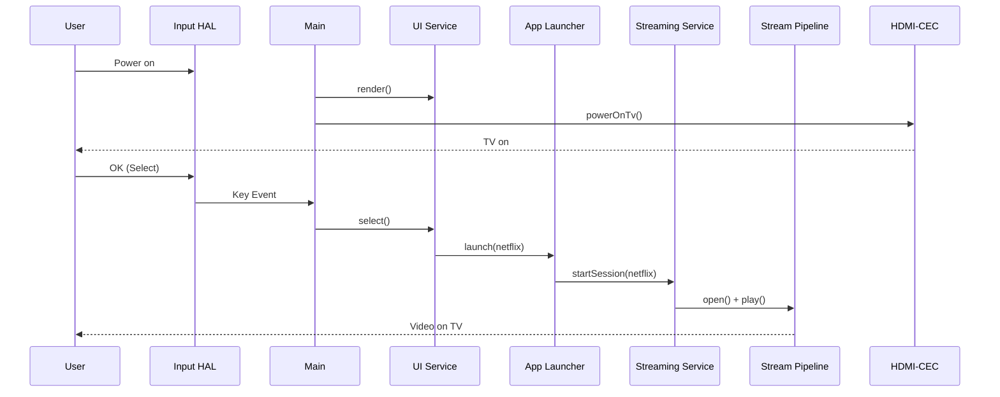

### 10.2 Remote Navigation → CEC Mapping

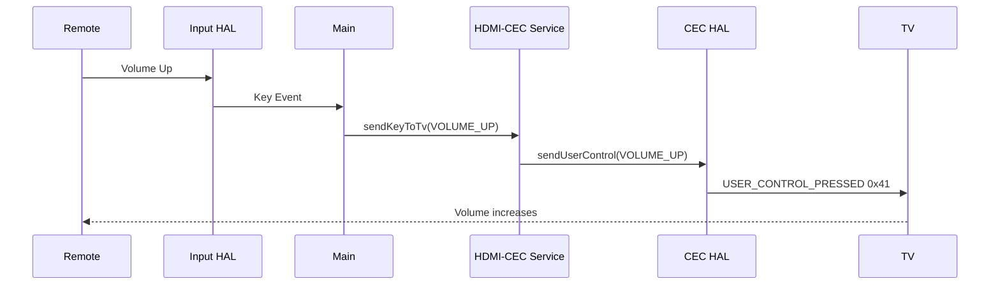

### 10.3 Bluetooth Pairing → Mobile App Control

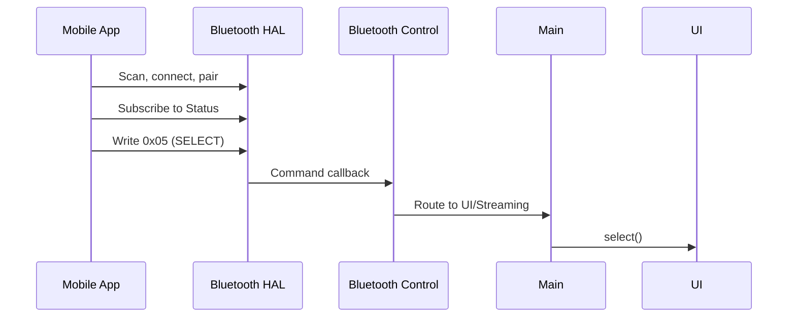

### 10.4 Streaming Flow: App Selection → Decode → HDMI

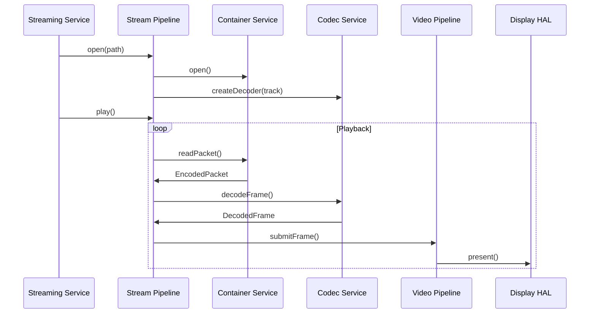

---

## 11. Hardware Acceleration and Performance

### 11.1 Decoding Strategies

| Strategy | Use Case |
|----------|----------|
| **Hardware accelerator** | Preferred for H.265, AV1, VP9; SoC-specific |
| **Software fallback** | When HW unavailable or format unsupported |
| **ICodecDecoder::setHardwareAcceleration** | Toggle per decoder instance |

### 11.2 Video Pipeline

- **Color spaces**: BT.709, BT.2020; HDR metadata passthrough
- **HDR**: HDR10, HLG; SMPTE ST 2086 mastering display
- **Upscaling**: Optional; `setUpscalingEnabled`

### 11.3 Power and Thermal

- **Sleep/wake**: IPowerHal; wake-on-remote via Input HAL
- **Thermal**: Platform-specific; throttling hooks (future)

### 11.4 Latency and Determinism

| Target | Value |
|--------|-------|
| **Input-to-action** | < 200 ms |
| **CEC command** | < 100 ms |
| **Frame rate** | 30/60 Hz |
| **Buffering** | Configurable; underrun recovery |

---

## 12. Security and Threat Modeling

### 12.1 Threat Model

#### Assets

| Asset | Sensitivity | Description |
|-------|-------------|-------------|
| DRM keys, license tokens | Critical | Content protection; exfil = piracy |
| User credentials (Wi-Fi, OAuth) | High | Stored in IStorageHal; config |
| Firmware image | High | Tampering → compromise |
| Session/playback state | Medium | User context |
| Telemetry/logs | Low | Anonymized; no PII |

#### Threats and Mitigations

| Threat | Mitigation | Residual Risk |
|-------|------------|---------------|
| **T1** Unauthorized firmware | Secure boot; code signing; OTA verify | Low – verified chain |
| **T2** Key exfiltration | IDrmHal; TEE/secure element; key isolation | Medium – platform-dependent |
| **T3** Man-in-the-middle (streams) | TLS for all streaming; cert validation | Low |
| **T4** BLE interception | Secure pairing; bonding; optional encryption | Low |
| **T5** Malicious OTA | Signed images; signature verify before apply | Low |
| **T6** Storage tampering | Encrypted config (future); access control | Medium |
| **T7** CEC spoofing | CEC is broadcast; TV trusts device – accepted | Accepted |
| **T8** Log/telemetry leakage | No PII; opt-in; retention limits | Low |

#### Data-Flow Diagram (Security-relevant)

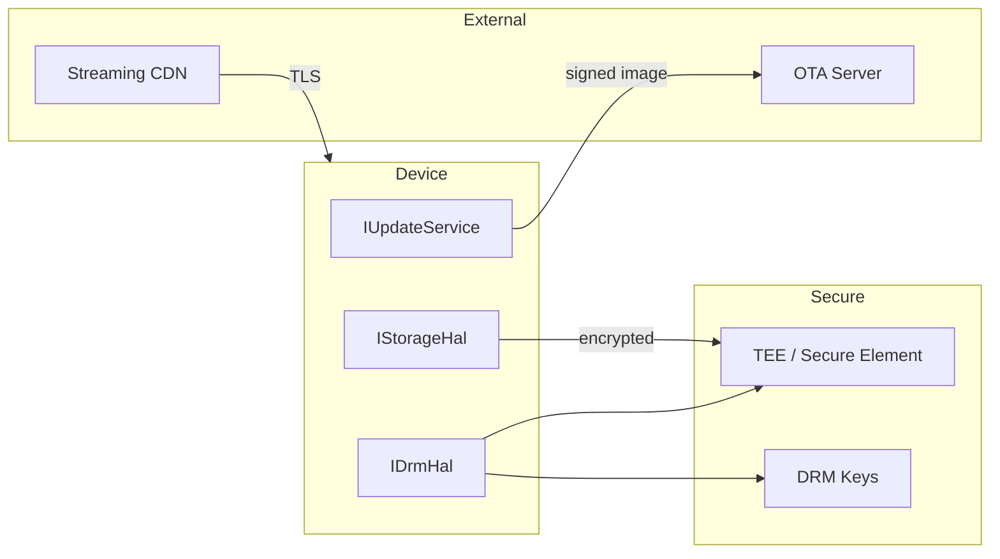

### 12.2 Security Controls Summary

| Control | Implementation |
|---------|----------------|
| **Secure boot** | Platform-dependent; verified boot chain when supported |
| **Code signing** | Firmware signed; OTA image verified before apply |
| **OTA integrity** | Ed25519 or RSA; signature check; rollback on failure |
| **DRM key management** | IDrmHal; keys in TEE/secure element; session isolate |
| **TLS** | All streaming endpoints; cert validation; no downgrade |
| **BLE security** | BLE secure pairing (passkey/numeric); bonding |

*Acceptance:* OTA update with invalid signature must be rejected; device must not apply. Verification: manual or automated OTA test.

---

## 13. Privacy and Telemetry Policy

### 13.1 Data Collected

| Data | Purpose | Retention | PII |
|------|---------|-----------|-----|
| Pipeline state (playing/paused) | Status to mobile app | Session only | No |
| Buffer underrun count | Telemetry (opt-in) | 90 days, anonymized | No |
| Error codes (decode, network) | Diagnostics | 90 days, anonymized | No |
| App launch success/failure | Aggregated metrics | 90 days | No |
| Wi-Fi SSID (hashed) | Connection troubleshooting | Local only | No |
| Logs | Debug | Not transmitted by default | No |

### 13.2 Purpose and Use

- **Operational**: Diagnose playback failures; improve buffering
- **Product**: Usage patterns (aggregate); no individual profiling
- **Compliance**: Data minimization; no sale of data

### 13.3 Opt-In / Opt-Out

- **Telemetry**: Opt-in at first run or in Settings; default OFF
- **Log collection**: Debug port only; not OTA-collected by default
- **Config**: All local; no cloud sync unless user enables

### 13.4 Access Controls

- Storage: IStorageHal; key-value; no external access by default
- Telemetry upload: Only when opt-in; TLS; to vendor endpoint

### 13.5 Data-Flow Diagram

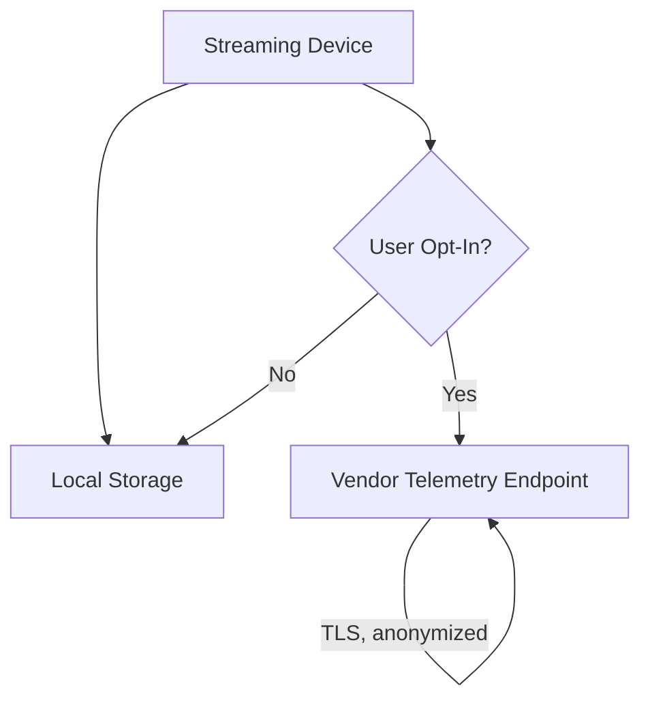

---

## 14. Non-Functional Requirements Mapping

| NFR Category | Target | Metric | Measurement | Acceptance |
|--------------|--------|--------|-------------|------------|
| **Performance** | UI responsive | Input-to-action < 200 ms | H-UI-002 latency | ≥95% of events under 200 ms |
| **Performance** | CEC responsive | CEC command < 100 ms | H-CEC-002 timing | ≥99% under 100 ms |
| **Performance** | Frame rate | 30/60 Hz | Display refresh | No dropped frames in normal playback |
| **Reliability** | Playback success | >99% sessions | I-001, I-002 | Count successful / total |
| **Reliability** | Network recovery | Graceful on disconnect | R-STRM-001 | Error msg, no crash |
| **Security** | TLS for streams | 100% | Code review, test | No plaintext for content |
| **Security** | BLE pairing | Secure pairing | H-BT-001 | Passkey or numeric comparison |
| **Accessibility** | Focus visible | Contrast ≥3:1 | Visual audit | Focus ring on all focusable |
| **Maintainability** | Build time | <5 min clean | CI | `make all` completes |
| **Maintainability** | Test coverage | ≥80% HAL, services | Ctest + coverage | Report generated |

---

## 15. Visual Consistency and Accessibility

### 15.1 Guidelines

- **Contrast**: Focus indicator and text ≥3:1 against background; target 4.5:1 for body text (WCAG 2.1 AA)
- **Typography**: Scalable; minimum 12 pt equivalent; support system font scaling
- **Focus indicators**: Visible 2–3 px ring; high contrast; no focus trap
- **Motion**: Respect `prefers-reduced-motion` where supported; animations <300 ms
- **D-pad navigation**: All interactive elements reachable; logical order

### 15.2 Accessibility Acceptance Criteria

| Criterion | Verification |
|-----------|--------------|
| Focus visible on all focusable elements | Manual; H-UI-002 |
| Navigate entire UI with D-pad only | I-001, I-002 |
| No infinite focus traps | Test navigate in loops |
| Color not sole indicator | Text/label with icons |

---

## 16. Testing Strategy and Plan

### 16.1 Tiered Testing

| Tier | Scope | Success Criteria | Test Data | Pass/Fail |
|------|-------|-------------------|-----------|-----------|
| **Unit** | HAL, mocks, data models | API contract; Result codes | Synthetic | 100% pass |
| **Service** | App Launcher, UI, Config, CEC, Codec, Container, Stream | State transitions; events | Mock HAL; reference media | 100% pass |
| **Integration** | Full flow (app launch, CEC, BT) | End-to-end user scenario | Mock HW | 100% pass |
| **Hardware-in-the-loop** | Real HDMI, CEC, BLE | Physical interop | Real TV, remote | Per test plan |
| **Performance** | Latency, frame rate | <200 ms input; 30/60 fps | Load; stress | Within NFR (§14) |
| **Security** | OTA signature; TLS | Reject invalid OTA; no plaintext | Invalid signed image | Reject |
| **End-to-end** | User journey | Power on → stream → back | Real or HiL | 100% pass |

### 16.2 Test Data

- **Reference media**: Licensed ProRes samples; synthetic H.265, AV1, VP9; MP4/MKV/MOV
- **Edge cases**: No extension, audio-only, corrupt headers, zero-length
- **CEC**: Multi-TV brands; fallback behavior

See [Test_Suite_Document.md](Test_Suite_Document.md).

### 16.3 Pass/Fail Thresholds

- **Unit/Service/Integration**: Zero failures; flaky tests must be fixed
- **Performance**: 95th percentile < 200 ms for input-to-action
- **Security**: Zero tolerance for invalid OTA apply, plaintext streams

---

## 17. Licensing and Compliance

### 17.1 DRM and Codec Licensing

| Item | License Owner | Notes |
|------|---------------|-------|
| **ProRes** | Apple | Required for decode; per-device or per-unit |
| **HEVC** | MPEG LA / HEVC Advance | Patent pool; platform vendor typically covers |
| **AV1** | AOMedia | Royalty-free |
| **VP9** | Google | Royalty-free |
| **Widevine** | Google | Per-vendor terms; integration via IDrmHal |
| **PlayReady** | Microsoft | Per-vendor terms |
| **FairPlay** | Apple | Per-vendor terms |

### 17.2 Regulatory Mappings

| Regulation / Standard | Application | Compliance Owner |
|-----------------------|-------------|------------------|
| **Bluetooth SIG** | BLE GATT, pairing | QA / Certification |
| **HDMI** | HDMI 1.4/2.0, HDCP | QA / Certification |
| **HDMI-CEC** | CEC 1.4 | QA / Certification |
| **Wi-Fi** | 802.11, regional (FCC, CE) | Platform / QA |
| **FCC/CE** | EMI, EMC | Hardware / Certification |

---

## 18. Build, CI/CD, and Release

### 18.1 Build System

| Component | Tool | Command |
|-----------|------|---------|
| **Build** | CMake 3.14+, Make | `cmake -B build && cmake --build build` or `make all` |
| **Tests** | CTest | `make test` or `ctest --output-on-failure` |
| **Docs** | MkDocs | `mkdocs build` |

### 18.2 CI Steps (GitHub Actions)

1. **Checkout** – `actions/checkout`
2. **Build** – `make all` or `cmake --build`
3. **Test** – `make test`; gate on pass
4. **Docs** – `mkdocs build --strict` (docs.yml)

### 18.3 Test Gates

- All unit and service tests must pass before merge
- No new linter errors
- Documentation build succeeds

### 18.4 Artifact Naming

- **Firmware**: `streaming_device-{version}-{platform}.img`
- **Version**: Semantic versioning (future): `MAJOR.MINOR.PATCH`

### 18.5 OTA Update Flow

1. IUpdateService checks for updates (HTTPS)
2. Download signed image
3. Verify signature (Ed25519/RSA)
4. Apply to inactive slot (A/B if supported)
5. Reboot; verified boot validates new image
6. On failure: rollback to previous image

### 18.6 Rollback Plan

- A/B slots: Boot from last-known-good if new image fails verification
- Single slot: Keep previous image in backup; restore on failure
- User-triggered rollback: Future; not in MVP

---

## 19. Compliance and Standards

| Standard | Application |
|----------|-------------|
| **HDMI** | HDMI Specification |
| **HDMI-CEC** | CEC 1.4 |
| **Bluetooth** | Bluetooth SIG |
| **Wi-Fi** | 802.11, regional regulations |

---

## 20. Platform and Build Environment

### 20.1 Target Hardware Specifications

| Spec | Minimum | Recommended |
|------|---------|-------------|
| **SoC** | Cortex-A class | Cortex-A53+ |
| **RAM** | 256 MB | 512 MB |
| **Flash** | 64 MB | 128 MB |
| **HDMI** | 1.4 | 2.0 |

### 20.2 Toolchain and Build

| Tool | Version |
|------|---------|
| **Compiler** | GCC/Clang C++17 |
| **Build** | CMake 3.14+, Make |
| **CI** | GitHub Actions |

### 20.3 Dependency Management

- **Third-party** – Codec libraries (platform); optional SDKs
- **Internal** – Header-only types; HAL and services in-tree

### 20.4 CI and Automated Testing

- **Build** – `make all` or `cmake --build`
- **Tests** – `make test`; 44 tests (HAL, services, integration)

---

## 21. Testing and Validation (Legacy Reference)

### 21.1 Testing Strategy by Tier

| Tier | Scope | Count |
|------|-------|-------|
| **Unit** | HAL, mocks | Many |
| **Service** | App Launcher, UI, Config, CEC, Codec, Container | Medium |
| **Integration** | Full flow (app launch, CEC, Bluetooth) | Few |

### 21.2 Test Data

- **Reference media** – Licensed samples for ProRes; synthetic for others
- **Edge cases** – No extension, audio-only, corrupt headers

See [Test_Suite_Document.md](Test_Suite_Document.md).

---

## 22. Deployment and Operations

### 22.1 Release Management

- **Versioning** – Semantic versioning (future)
- **Git** – main branch; tags for releases

### 22.2 OTA Update and Rollback

- **Workflow** – Download → verify → apply
- **Rollback** – A/B slots where supported; fallback to previous image

### 22.3 Field Diagnostics

- **Log collection** – Via telemetry or debug port
- **Status** – Pipeline state, CEC presence, WiFi state

---

## 23. Documentation and Deliverables

### 23.1 Document Formats

| Format | Use |
|--------|-----|
| **Markdown** | Primary; MkDocs for web site |
| **Mermaid** | Diagrams (architecture, sequence) |

### 23.2 Artifacts

| Artifact | Location |
|----------|----------|
| **System architecture** | Implementation_Document.md, architecture/ |
| **API reference** | api/, Codec_Container_API.md, Bluetooth_Control_Protocol.md |
| **Developer guides** | guides/, development/ |
| **Config guide** | guides/hdmi-setup.md |

---

## 24. Risks and Mitigations

| Risk | Mitigation |
|------|------------|
| **ProRes licensing cost** | Optional codec; disable if not licensed |
| **DRM integration complexity** | HAL abstraction; vendor-specific drivers |
| **CEC interoperability** | Test on multiple TV brands; fallback to passthrough |
| **Supply chain** | Multi-SoC HAL; swappable drivers |
| **Security vulnerability** | Secure OTA; signed updates |

### Open Questions

- SoC-specific hardware decoder integration
- Multi-language UI implementation

---

## 25. Appendix and Glossary

### 25.1 Glossary

| Term | Definition |
|------|------------|
| **HAL** | Hardware Abstraction Layer |
| **SOA** | Service-Oriented Architecture |
| **CEC** | Consumer Electronics Control (HDMI) |
| **GATT** | Generic Attribute Profile (BLE) |
| **DRM** | Digital Rights Management |
| **HDR** | High Dynamic Range |
| **PTS** | Presentation Time Stamp |
| **OTA** | Over-The-Air |

### 25.2 Acronyms

| Acronym | Expansion |
|---------|-----------|
| HDMI | High-Definition Multimedia Interface |
| CEC | Consumer Electronics Control |
| BLE | Bluetooth Low Energy |
| A2DP | Advanced Audio Distribution Profile |
| TLS | Transport Layer Security |
| HEVC | High Efficiency Video Coding |
| AV1 | AOMedia Video 1 |
| HDR10 | HDR 10-bit |

### 25.3 Data Dictionaries

See `include/streaming_device/types.hpp`, `include/streaming_device/media_types.hpp`, and [schemas/streaming_device_schemas.json](schemas/streaming_device_schemas.json).

### 25.4 Change History

| Version | Date | Changes |
|---------|------|---------|
| 1.0 | Feb 2025 | Initial release |
| 2.0 | Feb 2025 | Design review & enrichment: Traceability, Design Decisions, Threat Model, Privacy, NFR mapping, Data Schemas, Testing Strategy, Build/CI/CD, Accessibility |

### 25.5 Cross-References

| Document | Purpose |
|----------|---------|
| [Implementation_Document.md](Implementation_Document.md) | Architecture, module map |
| [Product_Requirements_Document.md](Product_Requirements_Document.md) | Requirements source |
| [Knowledge_Base.md](Knowledge_Base.md) | Consolidated reference |
| [Test_Suite_Document.md](Test_Suite_Document.md) | Test cases |
| [Codec_Container_API.md](Codec_Container_API.md) | Codec/Container API |
| [Bluetooth_Control_Protocol.md](Bluetooth_Control_Protocol.md) | BLE GATT protocol |
| [Design_Review_Checklist.md](Design_Review_Checklist.md) | Review checklist for product/test |

---

*Related documents: [Implementation_Document.md](Implementation_Document.md), [Product_Requirements_Document.md](Product_Requirements_Document.md), [Knowledge_Base.md](Knowledge_Base.md), [Test_Suite_Document.md](Test_Suite_Document.md)*
