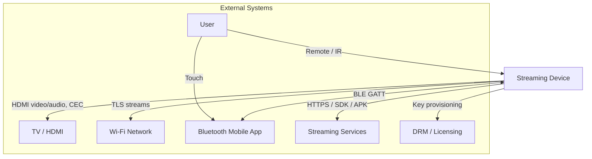
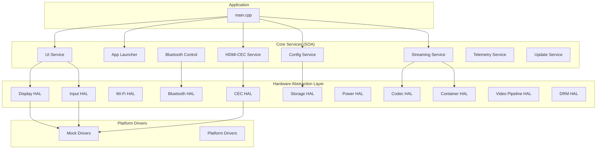
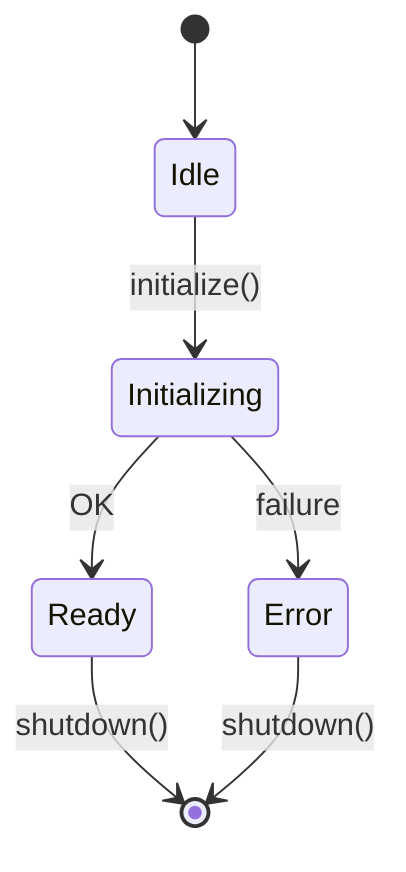
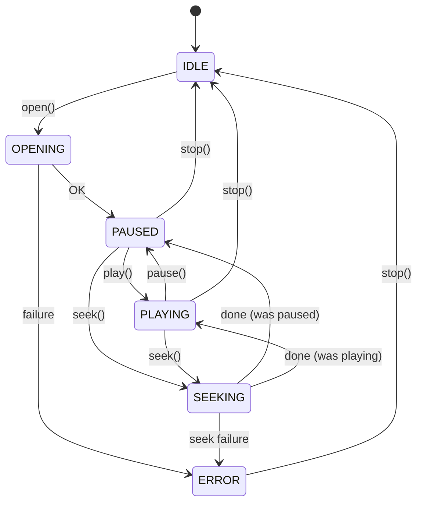
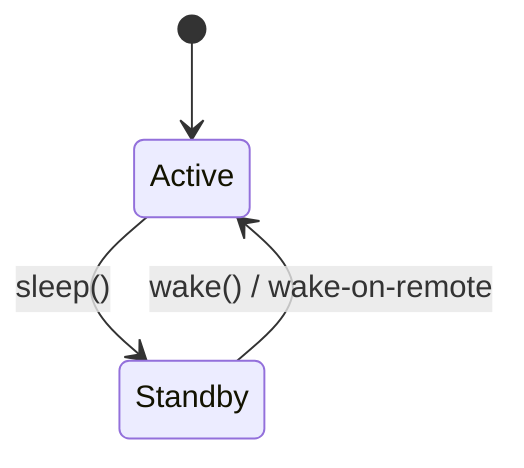
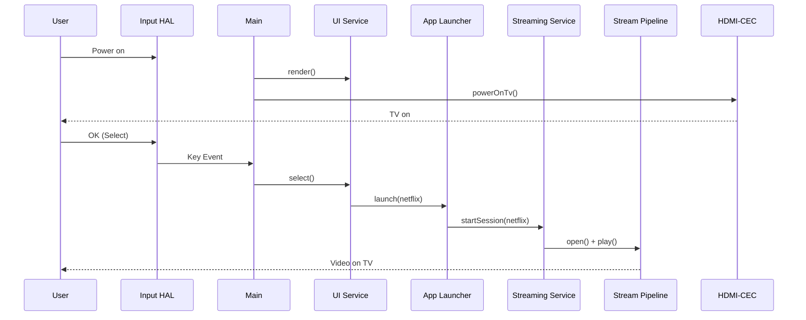
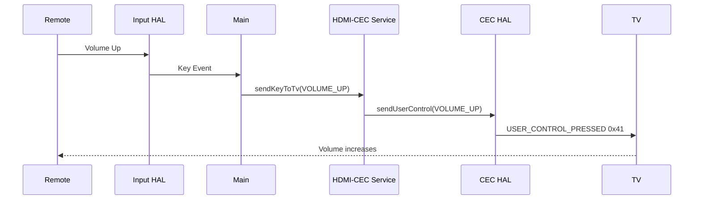
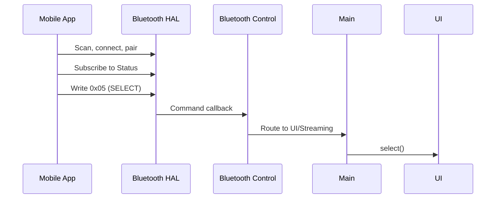
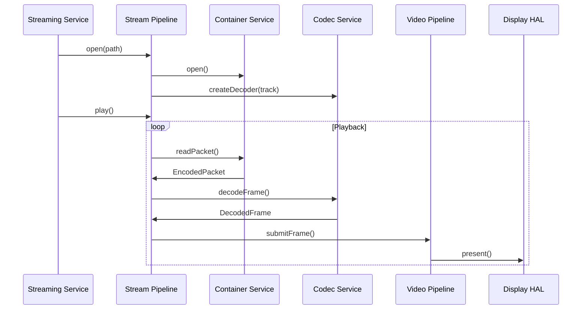

# Detailed Design Document: Portable HDMI Streaming Device

**Version:** 1.0  
**Date:** February 2025  
**Status:** Final  
**Format:** Markdown

---

## Table of Contents

1. [Executive Summary](#1-executive-summary)
2. [System Context](#2-system-context)
3. [Architecture Overview](#3-architecture-overview)
4. [Hardware Abstraction Layer Details](#4-hardware-abstraction-layer-hal-details)
5. [Software Architecture and Design](#5-software-architecture-and-design)
6. [Interfaces and API Design](#6-interfaces-and-api-design)
7. [Data Flow and Sequence Diagrams](#7-data-flow-and-sequence-diagrams)
8. [Hardware Acceleration and Performance](#8-hardware-acceleration-and-performance)
9. [Security and Privacy](#9-security-and-privacy)
10. [Compliance and Licensing](#10-compliance-and-licensing)
11. [Platform and Build Environment](#11-platform-and-build-environment)
12. [Testing and Validation](#12-testing-and-validation)
13. [Deployment and Operations](#13-deployment-and-operations)
14. [Documentation and Deliverables](#14-documentation-and-deliverables)
15. [Risks and Mitigations](#15-risks-and-mitigations)
16. [Appendix](#16-appendix)

---

## 1. Executive Summary

### 1.1 Product Overview

The **Portable HDMI Streaming Device** is a firmware-driven embedded system that connects to a TV via HDMI. It delivers a home-page launcher for streaming apps (Netflix, Prime Video, Hulu, Disney+), streams content over Wi-Fi, and supports control via remote, HDMI-CEC, and a companion mobile app over Bluetooth.

### 1.2 Goals

| Goal | Description |
|------|-------------|
| **Simplicity** | Plug-and-play HDMI connection; minimal user setup |
| **Unified Control** | Single remote for TV and device; CEC integration |
| **Streaming** | Wi-Fi delivery with TLS; multi-codec support |
| **Extensibility** | HAL and SOA architecture; swappable drivers |
| **Reliability** | Graceful error handling; OTA updates |

### 1.3 Target Hardware Platform

- **SoC**: ARM or RISC-V class; target: Cortex-A series or equivalent
- **Memory**: 256 MB RAM minimum; 512 MB recommended for 4K
- **Storage**: Flash for firmware; persistent config
- **Peripherals**: HDMI (1.4+), Wi-Fi, Bluetooth/BLE, IR receiver

### 1.4 Key Features

| Feature | Description |
|---------|-------------|
| **HDMI** | 1080p/4K video and audio passthrough |
| **HDMI-CEC** | Power, volume, navigation control of TV |
| **Wi-Fi** | Client for streaming; TLS for secure delivery |
| **Bluetooth** | A2DP audio; GATT control for mobile app |
| **Codecs** | H.265, AV1, VP9, MPEG-4, ProRes |
| **Containers** | MP4, MOV, MKV |
| **DRM** | HAL hooks for Widevine/PlayReady/FairPlay |

### 1.5 Core Use Cases

1. **Launch apps from home page** – Navigate with remote, select app icon, launch streaming session
2. **HDMI-CEC TV control** – Power on/off TV, volume, navigation passthrough
3. **Wi-Fi streaming** – Connect to network, stream from app content servers
4. **Bluetooth control** – Pair mobile app, send navigation and playback commands
5. **Mobile app integration** – Companion app for discovery, pairing, control

---

## 2. System Context

### 2.1 System Context Diagram

### 2.2 External Actors and Systems

| Actor/System | Interface | Description |
|--------------|-----------|-------------|
| **TV / HDMI** | HDMI Type A, CEC bus | Video/audio output; CEC command exchange |
| **Wi-Fi Network** | 802.11, TLS | Stream delivery, OTA updates |
| **Bluetooth Devices** | BLE GATT, A2DP | Mobile app control; audio sink |
| **Streaming Services** | HTTPS, SDK/APK | Netflix, Prime, Hulu, etc. content delivery |
| **DRM / Licensing** | Vendor APIs | Widevine, PlayReady; ProRes, HEVC licensing |

### 2.3 Interfaces to External Systems

| Interface | Protocol | Notes |
|-----------|----------|-------|
| **HDMI** | HDMI 1.4/2.0 spec | Video, audio, EDID; HDCP when required |
| **HDMI-CEC** | CEC 1.4 | User control codes, power, standby |
| **Wi-Fi** | 802.11n/ac, wpa_supplicant | TLS for streaming endpoints |
| **Bluetooth** | BLE 4.x+, GATT | Custom control service UUID |
| **Streaming SDKs** | HTTPS, vendor APIs | App-specific; auth, CDN |
| **DRM** | Vendor-specific | Key request/response, license tokens |

---

## 3. Architecture Overview

### 3.1 High-Level Architectural Diagram

### 3.2 Layer Definitions

| Layer | Responsibility |
|-------|----------------|
| **Application** | Main loop, input routing, service orchestration |
| **Core Services (SOA)** | UI, app launch, streaming, CEC, config, telemetry, update |
| **Hardware Abstraction Layer** | Abstract interfaces; platform-independent APIs |
| **Platform Drivers** | Mock (test) or real hardware implementations |

### 3.3 Security and Compliance Layer

- **Secure boot** – Verified boot chain (platform-dependent)
- **Code signing** – Firmware signed; OTA verification
- **DRM** – Content protection via IDrmHal; key isolation

### 3.4 DRM / Content Protection Layer

- **IDrmHal** – Request keys, release session, content protection check
- **Hooks** – Integrate Widevine, PlayReady, FairPlay
- **Key isolation** – Secure storage; TEE where available

---

## 4. Hardware Abstraction Layer (HAL) Details

### 4.1 HAL Domains and API Surface

| HAL | Interface | Key Methods | Data Models |
|-----|-----------|-------------|-------------|
| **Display** | IDisplayHal | initialize, setDisplayMode, getFramebuffer, present, clear | ResolutionInfo, framebuffer |
| **Input** | IInputHal | initialize, poll, injectKey, setInputCallback | InputEvent, RemoteKey |
| **Wi-Fi** | IWifiHal | connect, disconnect, getState, resolveHost | WifiState |
| **Bluetooth** | IBluetoothHal | initialize, registerControlService, writeCharacteristic | BluetoothState |
| **HDMI-CEC** | IHdmiCecHal | sendPowerOn, sendStandby, sendUserControl, sendRemoteKey | CecMessage, CecUserControlCode |
| **Storage** | IStorageHal | read, write, exists, remove | Key-value strings |
| **Power** | IPowerHal | sleep, wake, getBatteryLevel | - |
| **Audio** | IAudioHal | setVolume, mute | - |
| **Codec** | ICodecDecoder | initialize, decodeFrame, flush, reset | DecodedFrame, EncodedPacket |
| **Container** | IContainerParser | openContainer, readPacket, seek, getTracks | TrackMetadata, EncodedPacket |
| **Video Pipeline** | IVideoPipeline | submitFrame, setOutputColorSpace, setHdrMetadata | DecodedFrame |
| **DRM** | IDrmHal | requestKeys, releaseSession, isContentProtected | - |

### 4.2 Error Handling Strategy

- **Result enum** – `device::Result::OK`, `ERROR_INVALID_PARAM`, `ERROR_IO`, etc.
- **No exceptions** – APIs return Result; callers check and handle
- **Recovery** – State rollback on failure; pipeline flush/reset on decode errors

### 4.3 State Diagrams

#### 4.3.1 Initialization State

#### 4.3.2 Stream Pipeline State

#### 4.3.3 Power Management

---

## 5. Software Architecture and Design

### 5.1 Service-Oriented Architecture (SOA)

#### 5.1.1 Core Services

| Service | Responsibility | Interface |
|---------|----------------|-----------|
| **UI Service** | Launcher, home page rendering, navigation | IUiService |
| **App Launcher** | App registry, launch, lifecycle | IAppLauncherService |
| **Streaming Service** | Pipeline orchestration, session management | IStreamingService |
| **HDMI-CEC Service** | Key mapping, CEC command generation | IHdmiCecService |
| **Bluetooth Control** | Mobile app command handling | IBluetoothControlService |
| **Config Service** | Persistent settings | IConfigService |
| **Telemetry** | Logging, metrics | ITelemetryService |
| **Update** | OTA workflow | IUpdateService |

#### 5.1.2 Inter-Service Communication

| Mechanism | Usage |
|-----------|-------|
| **Event Bus** | APP_LAUNCHED, APP_STOPPED; decoupled publish/subscribe |
| **Synchronous calls** | Direct service-to-service (e.g., main → CEC, UI → launcher) |
| **Callbacks** | Status, telemetry, input events |

### 5.2 Modules and Responsibilities

| Module | Responsibility |
|--------|----------------|
| **UI Service** | Focus model, D-pad navigation, accessibility-ready design |
| **App Launcher** | App catalog from config; auth hooks; session lifecycle |
| **Streaming Service** | Pipeline open/play/pause/seek; buffering; error recovery |
| **HDMI/CEC Manager** | RemoteKey → CecUserControlCode; TV state sync |
| **Bluetooth Control** | GATT Command/Status; pairing; control channel protocol |
| **Network/Streaming** | TLS, content delivery, DRM licensing, QoS |
| **Update and Telemetry** | Secure OTA; log collection; metrics |

### 5.3 Data Models

| Model | Description |
|-------|-------------|
| **AppMetadata** | id, name, icon_path, package_uri, auth_endpoint |
| **TrackMetadata** | type, track_id, duration, VideoTrackInfo, AudioTrackInfo |
| **Streaming session** | app_id, session_id, state (IDLE/PLAYING/PAUSED) |
| **HdrMetadata** | color primaries, transfer, mastering display, MaxCLL/MaxFALL |

---

## 6. Interfaces and API Design

### 6.1 Codec/Decoder API

See [Codec_Container_API.md](Codec_Container_API.md). Key interface: `ICodecDecoder` with `decodeFrame`, `flush`, `reset`, `getCapabilities`.

### 6.2 Container/Demuxer API

See [Codec_Container_API.md](Codec_Container_API.md). Key interface: `IContainerParser` with `openContainer`, `readPacket`, `seek`, `getTracks`.

### 6.3 Remote Control API

- **HDMI-CEC pathway**: `IHdmiCecHal::sendRemoteKey(RemoteKey)` → `sendUserControl(CecUserControlCode)`
- **Bluetooth pathway**: GATT Command characteristic; see [Bluetooth_Control_Protocol.md](Bluetooth_Control_Protocol.md)

### 6.4 Error Handling and Logging

| Contract | Description |
|----------|-------------|
| **Result codes** | OK, ERROR_*; no exceptions across HAL/service boundary |
| **Telemetry hooks** | setStatusCallback, setTelemetryCallback for pipeline |
| **Logging** | Logger utility; levels: INFO, WARN, ERROR |

---

## 7. Data Flow and Sequence Diagrams

### 7.1 User Flow: Power On → Home Page → App Launch → Playback

### 7.2 Remote Navigation → CEC Mapping

### 7.3 Bluetooth Pairing → Mobile App Control

### 7.4 Streaming Flow: App Selection → Decode → HDMI

---

## 8. Hardware Acceleration and Performance

### 8.1 Decoding Strategies

| Strategy | Use Case |
|----------|----------|
| **Hardware accelerator** | Preferred for H.265, AV1, VP9; SoC-specific |
| **Software fallback** | When HW unavailable or format unsupported |
| **ICodecDecoder::setHardwareAcceleration** | Toggle per decoder instance |

### 8.2 Video Pipeline

- **Color spaces**: BT.709, BT.2020; HDR metadata passthrough
- **HDR**: HDR10, HLG; SMPTE ST 2086 mastering display
- **Upscaling**: Optional; `setUpscalingEnabled`

### 8.3 Power and Thermal

- **Sleep/wake**: IPowerHal; wake-on-remote via Input HAL
- **Thermal**: Platform-specific; throttling hooks (future)

### 8.4 Latency and Determinism

| Target | Value |
|--------|-------|
| **Input-to-action** | < 200 ms |
| **CEC command** | < 100 ms |
| **Frame rate** | 30/60 Hz |
| **Buffering** | Configurable; underrun recovery |

---

## 9. Security and Privacy

### 9.1 Secure Boot and Code Signing

- **Platform-dependent** – Verified boot chain when supported
- **OTA** – Signed update images; verification before apply

### 9.2 Secure OTA Update Process

1. Check for updates (HTTPS)
2. Download signed image
3. Verify signature
4. Apply; rollback on failure

### 9.3 DRM and Key Management

- **IDrmHal** – Abstract key request/release
- **Key storage** – Secure element or TEE when available

### 9.4 Bluetooth Security

- **Pairing** – BLE secure pairing; passkey or numeric comparison
- **Bonding** – Persistent keys

### 9.5 Data Handling

- **Logging** – No PII in logs
- **Telemetry** – Opt-in; anonymized
- **Config** – Local storage; no cloud sync by default

---

## 10. Compliance and Licensing

### 10.1 Standards

| Standard | Application |
|----------|-------------|
| **HDMI** | HDMI Specification |
| **HDMI-CEC** | CEC 1.4 |
| **Bluetooth** | Bluetooth SIG |
| **Wi-Fi** | 802.11, regional regulations |

### 10.2 DRM and Codec Licensing

| Item | Notes |
|------|-------|
| **ProRes** | Apple license required |
| **HEVC** | Patent pool; platform vendor typically covers |
| **AV1** | Royalty-free |
| **Widevine/PlayReady** | Per-vendor terms |

### 10.3 Accessibility and Localization

- **Navigation** – D-pad; focus visible
- **Localization** – UI strings; config-driven (future)

---

## 11. Platform and Build Environment

### 11.1 Target Hardware Specifications

| Spec | Minimum | Recommended |
|------|---------|-------------|
| **SoC** | Cortex-A class | Cortex-A53+ |
| **RAM** | 256 MB | 512 MB |
| **Flash** | 64 MB | 128 MB |
| **HDMI** | 1.4 | 2.0 |

### 11.2 Toolchain and Build

| Tool | Version |
|------|---------|
| **Compiler** | GCC/Clang C++17 |
| **Build** | CMake 3.14+, Make |
| **CI** | GitHub Actions |

### 11.3 Dependency Management

- **Third-party** – Codec libraries (platform); optional SDKs
- **Internal** – Header-only types; HAL and services in-tree

### 11.4 CI and Automated Testing

- **Build** – `make all` or `cmake --build`
- **Tests** – `make test`; 44 tests (HAL, services, integration)

---

## 12. Testing and Validation

### 12.1 Testing Strategy by Tier

| Tier | Scope | Count |
|------|-------|-------|
| **Unit** | HAL, mocks | Many |
| **Service** | App Launcher, UI, Config, CEC, Codec, Container | Medium |
| **Integration** | Full flow (app launch, CEC, Bluetooth) | Few |

### 12.2 Test Data

- **Reference media** – Licensed samples for ProRes; synthetic for others
- **Edge cases** – No extension, audio-only, corrupt headers

See [Test_Suite_Document.md](Test_Suite_Document.md).

---

## 13. Deployment and Operations

### 13.1 Release Management

- **Versioning** – Semantic versioning (future)
- **Git** – main branch; tags for releases

### 13.2 OTA Update and Rollback

- **Workflow** – Download → verify → apply
- **Rollback** – A/B slots where supported; fallback to previous image

### 13.3 Field Diagnostics

- **Log collection** – Via telemetry or debug port
- **Status** – Pipeline state, CEC presence, WiFi state

---

## 14. Documentation and Deliverables

### 14.1 Document Formats

| Format | Use |
|--------|-----|
| **Markdown** | Primary; MkDocs for web site |
| **Mermaid** | Diagrams (architecture, sequence) |

### 14.2 Artifacts

| Artifact | Location |
|----------|----------|
| **System architecture** | Implementation_Document.md, architecture/ |
| **API reference** | api/, Codec_Container_API.md, Bluetooth_Control_Protocol.md |
| **Developer guides** | guides/, development/ |
| **Config guide** | guides/hdmi-setup.md |

---

## 15. Risks and Mitigations

| Risk | Mitigation |
|------|------------|
| **ProRes licensing cost** | Optional codec; disable if not licensed |
| **DRM integration complexity** | HAL abstraction; vendor-specific drivers |
| **CEC interoperability** | Test on multiple TV brands; fallback to passthrough |
| **Supply chain** | Multi-SoC HAL; swappable drivers |
| **Security vulnerability** | Secure OTA; signed updates |

### Open Questions

- SoC-specific hardware decoder integration
- Multi-language UI implementation

---

## 16. Appendix

### 16.1 Glossary

| Term | Definition |
|------|------------|
| **HAL** | Hardware Abstraction Layer |
| **SOA** | Service-Oriented Architecture |
| **CEC** | Consumer Electronics Control (HDMI) |
| **GATT** | Generic Attribute Profile (BLE) |
| **DRM** | Digital Rights Management |
| **HDR** | High Dynamic Range |
| **PTS** | Presentation Time Stamp |
| **OTA** | Over-The-Air |

### 16.2 Acronyms

| Acronym | Expansion |
|---------|-----------|
| HDMI | High-Definition Multimedia Interface |
| CEC | Consumer Electronics Control |
| BLE | Bluetooth Low Energy |
| A2DP | Advanced Audio Distribution Profile |
| TLS | Transport Layer Security |
| HEVC | High Efficiency Video Coding |
| AV1 | AOMedia Video 1 |
| HDR10 | HDR 10-bit |

### 16.3 Data Dictionaries

See `include/streaming_device/types.hpp`, `include/streaming_device/media_types.hpp`.

### 16.4 Change History

| Version | Date | Changes |
|---------|------|---------|
| 1.0 | Feb 2025 | Initial release |

---

*Related documents: [Implementation_Document.md](Implementation_Document.md), [Product_Requirements_Document.md](Product_Requirements_Document.md), [Knowledge_Base.md](Knowledge_Base.md), [Test_Suite_Document.md](Test_Suite_Document.md)*
