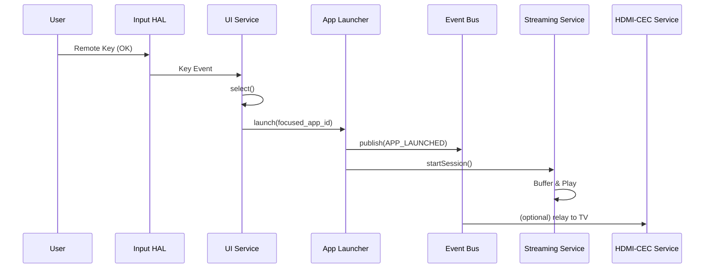
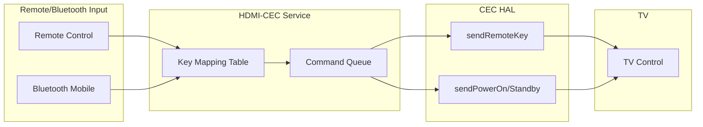

# Streaming Device Firmware - Implementation Document

## 1. Architecture Overview

### 1.1 High-Level Block Diagram

```
┌─────────────────────────────────────────────────────────────────────────────────┐
│                           STREAMING DEVICE FIRMWARE                              │
├─────────────────────────────────────────────────────────────────────────────────┤
│  ┌─────────────┐  ┌─────────────┐  ┌─────────────┐  ┌─────────────┐            │
│  │ UI Service  │  │ App Launcher│  │  Streaming   │  │  HDMI-CEC   │            │
│  │             │  │   Service   │  │   Service    │  │   Service   │            │
│  └──────┬──────┘  └──────┬──────┘  └──────┬──────┘  └──────┬──────┘            │
│         │                │                │                │                    │
│  ┌──────┴────────────────┴────────────────┴────────────────┴──────┐            │
│  │                    Event Bus (Inter-Service Communication)     │            │
│  └───────────────────────────────────────────────────────────────┘            │
│         │                │                │                │                    │
│  ┌──────┴────────────────┴────────────────┴────────────────┴──────┐            │
│  │                    HARDWARE ABSTRACTION LAYER (HAL)             │            │
│  │  Display │ Input │ Wi-Fi │ Bluetooth │ HDMI-CEC │ Storage │ Power│            │
│  │  Codec   │ Container │ Video Pipeline │ DRM │ Audio                          │
│  └─────────────────────────────────────────────────────────────────┘            │
│         │                │                │                │                    │
│  ┌──────┴────────────────┴────────────────┴────────────────┴──────┐            │
│  │                    PLATFORM DRIVERS (Mock / Real)               │            │
│  └─────────────────────────────────────────────────────────────────┘            │
└─────────────────────────────────────────────────────────────────────────────────┘
         │                │                │                │
         ▼                ▼                ▼                ▼
    ┌─────────┐     ┌──────────┐     ┌──────────┐     ┌──────────┐
    │  HDMI   │     │   TV     │     │   Wi-Fi  │     │ Bluetooth│
    │ Display │     │  (CEC)   │     │  Network │     │  Mobile  │
    └─────────┘     └──────────┘     └──────────┘     └──────────┘
```

### 1.2 Physical Setup: HDMI Connection to TV

#### 1.2.1 Visual Reference – Connection Diagram

```
                    ┌─────────────────────────────────────┐
                    │              YOUR TV                 │
                    │  ┌─────────────────────────────┐   │
                    │  │     HDMI INPUT PORTS         │   │
                    │  │   (usually on side or back)   │   │
                    │  │                              │   │
                    │  │   [HDMI 1] [HDMI 2] [HDMI 3]  │   │
                    │  │      ▲                        │   │
                    │  │      │                        │   │
                    │  └──────┼────────────────────────┘   │
                    └─────────┼─────────────────────────────┘
                              │
                    ┌─────────┴─────────┐
                    │   HDMI CABLE      │
                    │   (Type A)        │
                    │   ◄═══ 19 pins    │
                    └─────────┬─────────┘
                              │
                    ┌─────────┴─────────────────────────────────┐
                    │         STREAMING DEVICE                   │
                    │  ┌─────────────────────────────────────┐  │
                    │  │  HDMI OUT port (female)              │  │
                    │  │  ▶ Connect cable HERE                │  │
                    │  └─────────────────────────────────────┘  │
                    │  ┌─────┐  ┌─────┐  ┌─────┐                │
                    │  │ USB │  │ DC  │  │ ... │  (power, etc)  │
                    │  └─────┘  └─────┘  └─────┘                │
                    └──────────────────────────────────────────┘
```

#### 1.2.2 Step-by-Step HDMI Connection Instructions

| Step | Action | Details |
|------|--------|---------|
| **1** | **Power off** | Turn off the TV and streaming device before connecting. |
| **2** | **Locate HDMI port on TV** | Find an HDMI input (HDMI 1, 2, 3, etc.) on the side or back panel. |
| **3** | **Locate HDMI port on device** | On the streaming device, find the HDMI **OUT** (or "HDMI" labeled) port. |
| **4** | **Connect HDMI cable** | Insert one end into the TV’s HDMI input; insert the other end into the device’s HDMI OUT. Ensure the connector is fully seated. |
| **5** | **Connect power** | Plug the streaming device into power (USB or DC). |
| **6** | **Power on** | Turn on the TV first, then the streaming device. |
| **7** | **Select HDMI input** | On the TV remote, choose the HDMI input you used (e.g., HDMI 1). |
| **8** | **Enable CEC (optional)** | In TV settings, enable HDMI-CEC (often named Anynet+, Bravia Sync, Simplink, etc.). |

#### 1.2.3 Cabling Reference

| Cable Type | Use Case | Notes |
|------------|----------|-------|
| **HDMI Type A (Standard)** | Device ↔ TV | 19 pins; common for consumer gear |
| **HDMI 1.4+** | 1080p, 3D | Minimum for 1080p |
| **HDMI 2.0+** | 4K @ 60Hz, HDR | Recommended for 4K streaming |
| **Max length** | Run length | Use active or fiber cables for runs >10 m |

### 1.3 Interface Architecture Diagram

```
┌─────────────────────────────────────────────────────────────────────────────────┐
│                        INTERFACE BOUNDARIES (SOA)                                 │
├─────────────────────────────────────────────────────────────────────────────────┤
│                                                                                  │
│   APPLICATION (main.cpp)                                                         │
│   ┌──────────────────────────────────────────────────────────────────────────┐  │
│   │  Uses: IUiService, IAppLauncherService, IStreamingService, IHdmiCecService │  │
│   └──────────────────────────────────────────────────────────────────────────┘  │
│                                        │                                         │
│                                        ▼                                         │
│   SERVICE INTERFACES (Pure Virtual / Abstract)                                    │
│   ┌─────────────┬─────────────┬─────────────┬─────────────┬─────────────────┐   │
│   │ IUiService  │IAppLauncher │IStreaming   │IHdmiCec     │ICodecService     │   │
│   │             │Service      │Service      │Service      │IContainerService │   │
│   └──────┬──────┴──────┬──────┴──────┬──────┴──────┬──────┴────────┬────────┘   │
│          │             │             │             │               │             │
│          ▼             ▼             ▼             ▼               ▼             │
│   HAL INTERFACES (Pure Virtual)                                                   │
│   ┌─────────────┬─────────────┬─────────────┬─────────────┬─────────────────┐   │
│   │IDisplayHal  │IInputHal    │IHdmiCecHal  │ICodecDecoder│IContainerParser │   │
│   │IWifiHal     │IBluetoothHal│IStorageHal  │IVideoPipeline│IDrmHal          │   │
│   └──────┬──────┴──────┬──────┴──────┬──────┴──────┬──────┴────────┬────────┘   │
│          │             │             │             │               │             │
│          ▼             ▼             ▼             ▼               ▼             │
│   IMPLEMENTATIONS (Drivers / Mocks)                                                │
│   ┌─────────────┬─────────────┬─────────────┬─────────────┬─────────────────┐   │
│   │MockDisplay  │MockInput   │MockHdmiCec  │MockCodec    │MockContainer    │   │
│   │PlatformDisp │PlatformIn  │PlatformCEC  │Decoder      │Parser           │   │
│   └─────────────┴─────────────┴─────────────┴─────────────┴─────────────────┘   │
└─────────────────────────────────────────────────────────────────────────────────┘
```

### 1.4 Media Pipeline Block Diagram

```
┌──────────────────────────────────────────────────────────────────────────────────┐
│                        STREAMING MEDIA PIPELINE                                    │
├──────────────────────────────────────────────────────────────────────────────────┤
│                                                                                   │
│   ┌─────────────┐    ┌─────────────┐    ┌─────────────┐    ┌─────────────┐      │
│   │  Container  │    │   Codec     │    │   Video     │    │  Display    │      │
│   │  Service    │───▶│  Service   │───▶│  Pipeline   │───▶│  HAL        │      │
│   │  (Demux)    │    │  (Decode)   │    │  (Color/HDR)│    │  (HDMI Out) │      │
│   └──────┬──────┘    └──────┬──────┘    └──────┬──────┘    └──────┬──────┘      │
│          │                  │                  │                  │              │
│          │  .mp4/.mov/.mkv  │  Raw frames      │  RGBA + HDR      │  Framebuffer │
│          │  EncodedPacket   │  DecodedFrame    │  metadata        │  HDMI signal │
│          │                  │                  │                  │              │
│   ┌──────▼──────┐    ┌──────▼──────┐    ┌──────▼──────┐    ┌──────▼──────┐      │
│   │IContainer   │    │ICodecDecoder│    │IVideoPipeline│    │  TV Display │      │
│   │Parser       │    │ H.265/AV1/  │    │ Color space │    │             │      │
│   │             │    │ VP9/MPEG-4  │    │ HDR metadata│    │             │      │
│   └─────────────┘    └─────────────┘    └─────────────┘    └─────────────┘      │
│                                                                                   │
└──────────────────────────────────────────────────────────────────────────────────┘
```

### 1.5 Layered Architecture Diagram (Mermaid)

```mermaid
graph TB
    subgraph Application["Application Layer"]
        Main[main.cpp]
    end

    subgraph Services["Service Layer (SOA)"]
        UI[UI Service]
        AppLauncher[App Launcher Service]
        Streaming[Streaming Service]
        Codec[Codec Service]
        Container[Container Service]
        Pipeline[Stream Pipeline]
        CEC[HDMI-CEC Service]
        BT[Bluetooth Control Service]
        Config[Config Service]
        Telemetry[Telemetry Service]
        Update[Update Service]
    end

    subgraph Common["Common"]
        EventBus[Event Bus]
        Logger[Logger]
    end

    subgraph HAL["Hardware Abstraction Layer"]
        DisplayHAL[Display HAL]
        InputHAL[Input HAL]
        WifiHAL[Wi-Fi HAL]
        BTHAL[Bluetooth HAL]
        CECHAL[HDMI-CEC HAL]
        StorageHAL[Storage HAL]
        PowerHAL[Power HAL]
        AudioHAL[Audio HAL]
        CodecHAL[Codec HAL]
        ContainerHAL[Container HAL]
        VideoPipelineHAL[Video Pipeline HAL]
    end

    subgraph Drivers["Platform Drivers"]
        MockDrivers[Mock Drivers]
        PlatformDrivers[Platform Drivers]
    end

    Main --> UI
    Main --> AppLauncher
    Main --> Streaming
    Main --> CEC
    Main --> Config
    Streaming --> Pipeline
    Pipeline --> Codec
    Pipeline --> Container
    UI --> EventBus
    AppLauncher --> EventBus
    CEC --> CECHAL
    BT --> BTHAL
    Config --> StorageHAL
    UI --> DisplayHAL
    UI --> InputHAL
    DisplayHAL --> MockDrivers
    InputHAL --> MockDrivers
    CECHAL --> MockDrivers
```



### 1.6 Data Flow - App Launch Sequence



### 1.7 HDMI-CEC Command Mapping



### 1.8 Key Mapping Table (Remote → CEC)

| Remote Key | CEC Opcode | CEC User Control |
|------------|------------|------------------|
| POWER | Image View On / Standby | - |
| UP | User Control Pressed | 0x01 |
| DOWN | User Control Pressed | 0x02 |
| LEFT | User Control Pressed | 0x03 |
| RIGHT | User Control Pressed | 0x04 |
| OK | User Control Pressed | 0x00 (Select) |
| BACK | User Control Pressed | 0x0D |
| VOLUME_UP | User Control Pressed | 0x41 |
| VOLUME_DOWN | User Control Pressed | 0x42 |
| MUTE | User Control Pressed | 0x43 |

## 2. Module Descriptions

### 2.1 HAL Interfaces

| HAL | Interface | Purpose |
|-----|-----------|---------|
| Display | IDisplayHal | Framebuffer, present, resolution |
| Input | IInputHal | Remote/IR/touch events |
| Wi-Fi | IWifiHal | Connect, scan, DNS |
| Bluetooth | IBluetoothHal | A2DP, GATT control service |
| HDMI-CEC | IHdmiCecHal | CEC commands to TV |
| Storage | IStorageHal | Key-value persistence |
| Power | IPowerHal | Sleep, wake, battery |
| Audio | IAudioHal | HDMI/A2DP audio output |
| Codec | ICodecDecoder | H.265, AV1, VP9, MPEG-4, ProRes |
| Container | IContainerParser | MP4, MOV, MKV demux |
| Video Pipeline | IVideoPipeline | Color convert, HDR, compositor |
| DRM | IDrmHal | Content protection hooks |

### 2.2 Service Dependencies

| Service | Depends On |
|---------|------------|
| UI Service | Display HAL, Input HAL |
| App Launcher | Event Bus |
| Streaming Service | StreamPipeline, CodecService, ContainerService |
| StreamPipeline | CodecService, ContainerService, Video Pipeline HAL |
| CodecService | Codec HAL (decoder factories) |
| ContainerService | Container HAL (demuxer) |
| HDMI-CEC Service | HDMI-CEC HAL |
| Bluetooth Control | Bluetooth HAL |
| Config Service | Storage HAL |

## 3. Build and Deployment

- **Build**: `cmake -B build && cmake --build build` or `make all`
- **Tests**: `cd build && ctest` or `make test`
- **Run**: `./build/streaming_device` or `make run`

## 4. Extensibility

- **New apps**: Add to `config/apps.json` and register via App Launcher
- **New HAL**: Implement interface, add to factory
- **New platform**: Add platform driver, select via CMake option
