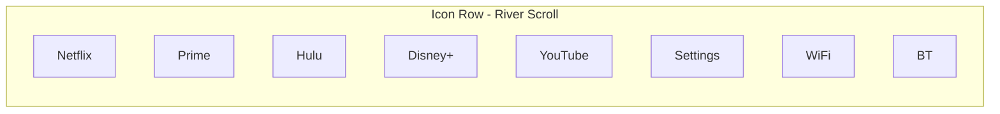

# TV-UI Design Specification: Portable HDMI Streaming Device

**Version:** 1.0  
**Date:** February 2025  
**Target:** 1080p/4K TV display via HDMI

---

## 1. Theme and Background

### 1.1 Color Palette

| Token | Hex | RGB | Usage |
|-------|-----|-----|-------|
| **Background** | `#000000` | 0, 0, 0 | Full-screen solid black |
| **Primary text** | `#FFFFFF` | 255, 255, 255 | Labels, titles |
| **Secondary text** | `#B0B0B0` | 176, 176, 176 | Subtle labels |
| **Focus border** | `#FFFFFF` | 255, 255, 255 | Selection outline |
| **Focus glow** | `#FFFFFF` @ 40% opacity | - | Rim glow on selection |
| **Accent** | `#1A1A2E` | 26, 26, 46 | Very subtle depth (parallax) |
| **Error/offline** | `#6B6B6B` | 107, 107, 107 | Disconnected state |
| **Connected** | `#00C853` | 0, 200, 83 | Wi-Fi/Bluetooth connected |

### 1.2 Mood

- **Sleek, modern, high-contrast**
- Minimal chrome; content-forward
- Dark-first for TV viewing

---

## 2. Main Layout

### 2.1 Layout Diagram

```
┌────────────────────────────────────────────────────────────────────────────┐
│                           FULL SCREEN (1920×1080)                            │
│                                                                              │
│                         #000000 SOLID BLACK                                  │
│                                                                              │
│                                                                              │
│                                                                              │
│                                                                              │
│                                                                              │
│                                                                              │
│  ┌──────────────────────────────────────────────────────────────────────┐  │
│  │           ICON ROW (river-style, horizontal scroll)                    │  │
│  │   [Netflix] [Prime] [Hulu] [Disney+] [YouTube] [Settings] [WiFi][BT]  │  │
│  │              ▲                                                         │  │
│  │         FOCUS (white border + glow)                                     │  │
│  │   Row Y: 70% from top; icons flow left-right; scroll reveals more       │  │
│  └──────────────────────────────────────────────────────────────────────┘  │
│                                                                              │
└────────────────────────────────────────────────────────────────────────────┘
```

### 2.2 Icon Row Specifications

| Property | Value |
|----------|-------|
| **Position** | Bottom 30% of screen (Y: 70% from top) |
| **Height** | 240 px (1080p) / 480 px (4K) |
| **Icon size** | 160×160 px (1080p) / 320×320 px (4K) |
| **Gap between icons** | 32 px |
| **Scroll** | Horizontal; river-like flow (icons enter/exit from edges) |
| **Visible icons** | ~6–8 at 1080p (depending on screen width) |
| **Edge handling** | At end: no wrap to start; subtle bounce or fade; Settings at far right |

---

## 3. River-Style Scroll Behavior

### 3.1 Flow Effect

- As user navigates **RIGHT**, icons scroll **left**; new icons appear from the right edge
- As user navigates **LEFT**, icons scroll **right**; new icons appear from the left edge
- Entry animation: icon slides in from off-screen (ease-out, 180–250 ms)
- Exit animation: icon slides out (ease-in, 180–250 ms)
- Subtle parallax: icons slightly closer to center have slight scale-up (1.0 → 1.05)

### 3.2 Edge Cases

| Scenario | Behavior |
|----------|----------|
| **First icon focused** | Left scroll limit; no wrap to end |
| **Last icon focused** | Right scroll limit; no wrap to start |
| **Empty row** | Show placeholder “No apps” message |
| **Single icon** | Centered; no scroll |

---

## 4. App Icons

### 4.1 Icon Specifications

| Property | Value |
|----------|-------|
| **Size** | 160×160 px (1080p), 320×320 px (4K) |
| **Format** | PNG/SVG; high-DPI for 4K |
| **Shape** | Square with 16 px corner radius (optional rounded) |
| **Label** | Optional: 14 px font beneath icon |
| **Subtitle** | Optional: 12 px secondary text |

### 4.2 Enter/Exit Animations

| State | Animation |
|-------|-----------|
| **Enter (from right)** | Translate X 80→0, opacity 0→1, 200 ms ease-out |
| **Exit (to left)** | Translate X 0→-80, opacity 1→0, 200 ms ease-in |
| **Enter (from left)** | Mirror of above |
| **Exit (to right)** | Mirror of above |

---

## 5. Selection and Navigation

### 5.1 Focus Indicator

| Element | Style |
|---------|-------|
| **Border** | 4 px solid white (#FFFFFF) |
| **Glow** | 12 px outer blur, 40% opacity white |
| **Scale** | Focused icon: 1.08× (8% larger) |
| **Transition** | 150 ms ease-out |

### 5.2 Navigation Matrix

| Key | Action | Wrap |
|-----|--------|------|
| **RIGHT** | Move focus right; scroll row left | No (stop at last) |
| **LEFT** | Move focus left; scroll row right | No (stop at first) |
| **UP** | Reserved (future: settings/header) | No |
| **DOWN** | Reserved (future: content row) | No |
| **OK/SELECT** | Launch app or open Settings | - |
| **BACK** | Exit app / close Settings panel | - |

### 5.3 Focus Transitions

- **Smooth scroll** when focus moves (icon row animates)
- **Micro-pulse** on selection (brief 1.02× scale for 80 ms, then settle)

---

## 6. Settings and Network Icons

### 6.1 Layout

```
[Netflix][Prime][Hulu][Disney+][YouTube] ... [Settings] [WiFi] [BT]
                                                    ▲
                                              Settings: far right before network icons
                                              WiFi/BT: small, top-right of row or inline
```

### 6.2 Settings Icon

| Property | Value |
|----------|-------|
| **Position** | End of app row (before WiFi/BT) |
| **Size** | Same as app icons |
| **Action** | Opens Settings panel on SELECT |

### 6.3 Settings Panel (Outline)

```
┌─────────────────────────────────────┐
│  Settings                           │
├─────────────────────────────────────┤
│  ► Network (Wi-Fi)                  │
│  ► Bluetooth                        │
│  ► Display (Resolution)             │
│  ► Accessibility                    │
│     - High contrast                 │
│     - Reduce motion                 │
│  ► About                            │
└─────────────────────────────────────┘
```

- Semi-transparent overlay (#1A1A2E @ 95% opacity)
- Panel width: 480 px; centered or right-aligned
- List navigable with UP/DOWN; BACK to close

### 6.4 Network Icons (Wi-Fi, Bluetooth)

| Property | Value |
|----------|-------|
| **Size** | 48×48 px (small, status only) |
| **Position** | Right edge of row or top-right corner |
| **Status** | Connected: green dot; Disconnected: gray icon |
| **Tooltip** | On focus: "Wi-Fi: HomeNetwork" / "Bluetooth: Paired" |
| **Label** | Below icon on focus; 12 px |

---

## 7. Visual Effects and Polish

### 7.1 Parallax

- Icons at center: scale 1.05
- Icons toward edges: scale 1.0
- Slight depth: 2–4 px shadow (blur 8 px) beneath icons

### 7.2 Micro-interactions

| Event | Effect |
|-------|--------|
| **Focus enter** | Border + glow fade in; scale 1.0→1.08 |
| **Focus leave** | Reverse |
| **Select (launch)** | Brief pulse 1.08→1.12→1.08, 120 ms |

### 7.3 Accessibility

| Requirement | Implementation |
|-------------|----------------|
| **Focus visible** | Always: 4 px white border + glow |
| **High contrast** | Option in Settings: increase border to 6 px, 100% opacity |
| **Reduce motion** | Setting to disable animations; instant transitions |

---

## 8. Typography

| Element | Font | Size (1080p) | Weight |
|---------|------|--------------|--------|
| **App label** | System sans (e.g., Roboto, Inter) | 14 px | Regular |
| **Subtitle** | Same | 12 px | Light |
| **Settings title** | Same | 18 px | Medium |
| **Settings items** | Same | 16 px | Regular |
| **Tooltip** | Same | 12 px | Regular |

---

## 9. Spacing and Grid

| Token | Value |
|-------|-------|
| **Icon gap** | 32 px |
| **Row padding (L/R)** | 48 px |
| **Row padding (bottom)** | 48 px |
| **Panel padding** | 24 px |

---

## 10. Accessibility and Performance

| Consideration | Implementation |
|---------------|----------------|
| **Scalable assets** | SVG or 2×/4× PNG for 4K |
| **Lightweight animations** | CSS transform/opacity only; 60 fps target |
| **Reduce motion** | User setting: disable translate/scale; instant focus |
| **Focus trap** | In Settings panel: focus stays within until BACK |
| **Screen reader** | Expose focused element ID/label to platform a11y APIs |

---

## 11. Wireframes

### 11.1 Initial Focus State (Netflix)

```
┌────────────────────────────────────────────────────────────────┐
│                                                                 │
│                                                                 │
│                                                                 │
│                                                                 │
│                                                                 │
│                                                                 │
│        [Netflix]  [Prime]  [Hulu]  [Disney+]  [YouTube] ...   │
│         ╔══════╗                                                │
│         ║  N   ║  ← white border + glow, scaled up              │
│         ╚══════╝                                                │
│         Netflix                                                │
└────────────────────────────────────────────────────────────────┘
```

### 11.2 Focus Moved Right (Prime Video)

```
┌────────────────────────────────────────────────────────────────┐
│                                                                 │
│                                                                 │
│                                                                 │
│                                                                 │
│                                                                 │
│                                                                 │
│   [Netflix]  [Prime]  [Hulu]  [Disney+]  [YouTube] ...         │
│              ╔══════╗                                            │
│              ║  P   ║  ← row scrolled left, Prime focused        │
│              ╚══════╝                                           │
│              Prime Video                                        │
└────────────────────────────────────────────────────────────────┘
```

### 11.3 Settings Panel Open

```
┌────────────────────────────────────────────────────────────────┐
│                                                                 │
│                                                                 │
│                        ┌──────────────────┐                     │
│                        │ Settings         │                     │
│                        ├──────────────────┤                     │
│                        │ ► Network        │                     │
│                        │   Bluetooth     │                     │
│                        │   Display       │                     │
│                        │   Accessibility │                     │
│                        │   About         │                     │
│                        └──────────────────┘                     │
│                                                                 │
│   [Netflix][Prime][Hulu][Disney+][YouTube][Settings][WiFi][BT] │
└────────────────────────────────────────────────────────────────┘
```

### 11.4 Network Icons with Status

```
                                                    [WiFi●] [BT○]
                                                     green   gray
                                                    (connected)(disconnected)
```

### 11.5 Icon Row Flow



---

## 12. Resolution Scaling

| Resolution | Icon size | Row height | Font scale |
|------------|-----------|------------|------------|
| 1280×720 | 120 px | 180 px | 0.75× |
| 1920×1080 | 160 px | 240 px | 1.0× |
| 3840×2160 | 320 px | 480 px | 2.0× |

---

## 13. Related Files

- **UI manifest**: `config/ui_manifest.json` – icon order, actions, metadata
- **App config**: `config/apps.json` – app registry (existing)
- **Implementation**: `src/services/ui_service.cpp` – navigation logic
- **HTML5 prototype**: `ui-prototype/` – interactive demo (index.html, styles.css, app.js, data/layout.json)
- **Wireframes & user journey**: [UI_Wireframes_and_User_Journey.md](UI_Wireframes_and_User_Journey.md) – screen wireframes and step-by-step flows

---

*This spec informs the UI service implementation and any future graphical frontend (e.g., OpenGL, Skia, web-based).*
