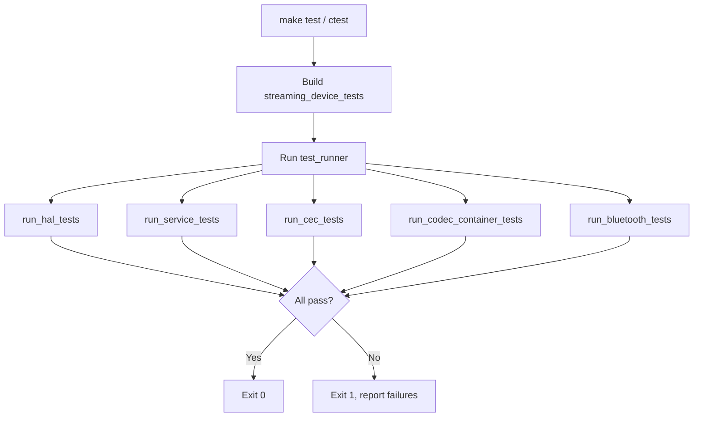

# Streaming Device Firmware - Test Suite Document

## 1. Test Strategy

- **Unit Tests**: HAL interfaces, services, mocks
- **Integration Tests**: End-to-end flows (app launch, CEC, Bluetooth)
- **Happy Path**: Expected user flows
- **Rainy Day**: Error handling, edge cases, timeouts

---

## 2. Test Architecture

### 2.1 Test Pyramid Diagram

```
                    ┌─────────────┐
                    │ Integration │  Few, slow, full stack
                    │   Tests     │  (I-001 to I-004)
                    └──────┬──────┘
                           │
              ┌────────────┴────────────┐
              │     Service Tests       │  Medium count
              │  (App Launcher, UI,     │  Mock HAL
              │   Config, Codec, etc.)  │
              └────────────┬────────────┘
                           │
    ┌──────────────────────┴──────────────────────┐
    │              HAL / Unit Tests               │  Many, fast
    │  (Display, Input, Storage, Mock drivers)    │  Isolated
    └────────────────────────────────────────────┘
```

### 2.2 Test Component Diagram

```
┌─────────────────────────────────────────────────────────────────────────────┐
│                         TEST RUNNER (test_runner.cpp)                         │
├─────────────────────────────────────────────────────────────────────────────┤
│                                                                              │
│  ┌─────────────┐  ┌─────────────┐  ┌─────────────┐  ┌─────────────────────┐│
│  │ run_hal_    │  │ run_service │  │ run_cec_    │  │ run_codec_container ││
│  │ tests()     │  │ _tests()    │  │ tests()     │  │ _tests()             ││
│  └──────┬──────┘  └──────┬──────┘  └──────┬──────┘  └──────┬───────────────┘│
│         │                │                │                │                 │
│         ▼                ▼                ▼                ▼                 │
│  ┌─────────────┐  ┌─────────────┐  ┌─────────────┐  ┌─────────────────────┐│
│  │ Display     │  │ App         │  │ HDMI-CEC    │  │ CodecService        ││
│  │ Input       │  │ Launcher    │  │ Service     │  │ ContainerService    ││
│  │ Storage     │  │ UI          │  │             │  │ StreamPipeline      ││
│  │ HAL         │  │ Config      │  │             │  │                      ││
│  └──────┬──────┘  └──────┬──────┘  └──────┬──────┘  └──────┬───────────────┘│
│         │                │                │                │                 │
│         └────────────────┴────────────────┴────────────────┘                 │
│                                    │                                          │
│                                    ▼                                          │
│  ┌─────────────────────────────────────────────────────────────────────────┐│
│  │                    MOCK DRIVERS (no real hardware)                       ││
│  │  MockDisplay, MockInput, MockStorage, MockCodec, MockContainer, etc.    ││
│  └─────────────────────────────────────────────────────────────────────────┘│
└─────────────────────────────────────────────────────────────────────────────┘
```

### 2.3 Interface Test Boundary Diagram

```
┌─────────────────────────────────────────────────────────────────────────────┐
│                    WHAT GETS TESTED AT EACH BOUNDARY                          │
├─────────────────────────────────────────────────────────────────────────────┤
│                                                                              │
│   APPLICATION                    SERVICE                     HAL             │
│   ┌──────────┐                  ┌──────────┐              ┌──────────┐     │
│   │ main.cpp │                  │ *Service │              │ *Hal     │     │
│   └────┬─────┘                  └────┬─────┘              └────┬─────┘     │
│        │                            │                          │            │
│        │  Integration tests         │  Service tests           │  Unit     │
│        │  (full flow)               │  (mock HAL)              │  tests    │
│        │                            │                          │            │
│        ▼                            ▼                          ▼            │
│   ┌──────────┐                  ┌──────────┐              ┌──────────┐     │
│   │ Uses     │ ─── interface ──▶│ Impl     │ ─── interface ──▶│ Mock   │     │
│   │ services │                  │ classes  │                  │ Driver  │     │
│   └──────────┘                  └──────────┘                  └──────────┘     │
│                                                                              │
│   Test focus:                    Test focus:                  Test focus:    │
│   - End-to-end flow             - Business logic             - API contract │
│   - User scenarios              - State transitions          - Error codes  │
│   - Cross-service               - Event publishing           - Edge cases   │
└─────────────────────────────────────────────────────────────────────────────┘
```

### 2.4 Test Execution Flow



---

## 3. Happy Path Test Cases

### 3.1 Display HAL

| ID | Scenario | Steps | Expected Result |
|----|----------|-------|-----------------|
| H-DIS-001 | Display init | Call initialize() | Result::OK, isConnected() true |
| H-DIS-002 | Set resolution | setDisplayMode(1080p) | Result::OK, getDisplayMode() returns 1920x1080 |
| H-DIS-003 | Present frame | getFramebuffer(), present() | Result::OK, callback invoked |
| H-DIS-004 | Clear screen | clear() | Result::OK |

### 3.2 Input HAL

| ID | Scenario | Steps | Expected Result |
|----|----------|-------|-----------------|
| H-INP-001 | Init and inject key | initialize(), injectKey(UP) | getLastKey() == UP |
| H-INP-002 | Key down callback | setInputCallback(), injectKey(OK) | Callback invoked with OK |
| H-INP-003 | Poll mode | injectKey(BACK), poll() | poll returns event with BACK |

### 3.3 App Launcher Service

| ID | Scenario | Steps | Expected Result |
|----|----------|-------|-----------------|
| H-APP-001 | Register app | registerApp(Netflix metadata) | getApps() contains Netflix |
| H-APP-002 | Launch app | launch(netflix) | status SUCCESS, non-empty session_id |
| H-APP-003 | Stop app | stop(session_id) | Result::OK, isAppActive() false |
| H-APP-004 | Launch unknown | launch(unknown_id) | status NOT_FOUND |

### 3.4 UI Service

| ID | Scenario | Steps | Expected Result |
|----|----------|-------|-----------------|
| H-UI-001 | Set icons | setAppIcons(ids, labels) | getFocusedElementId() == first id |
| H-UI-002 | Navigate right | navigate(RIGHT) | Focus moves to next icon |
| H-UI-003 | Select | select() | Returns OK |
| H-UI-004 | Render | render() | Result::OK |

### 3.5 HDMI-CEC Service

| ID | Scenario | Steps | Expected Result |
|----|----------|-------|-----------------|
| H-CEC-001 | Power on TV | powerOnTv() | Result::OK |
| H-CEC-002 | Send volume up | sendKeyToTv(VOLUME_UP) | Result::OK |
| H-CEC-003 | Standby | standbyTv() | Result::OK |
| H-CEC-004 | TV present | isTvPresent() | true when TV connected |

### 3.6 Bluetooth Control Service

| ID | Scenario | Steps | Expected Result |
|----|----------|-------|-----------------|
| H-BT-001 | Init | initialize() | Result::OK |
| H-BT-002 | Send status | sendStatus(data) | Result::OK |
| H-BT-003 | Command callback | setCommandCallback(), simulate write | Callback invoked |

### 3.7 Config Service

| ID | Scenario | Steps | Expected Result |
|----|----------|-------|-----------------|
| H-CFG-001 | Set/get string | setString(k,v), getString(k) | value matches |
| H-CFG-002 | Set/get int | setInt(k,42), getInt(k) | 42 |
| H-CFG-003 | Set/get bool | setBool(k,true), getBool(k) | true |

### 3.8 Streaming Service

| ID | Scenario | Steps | Expected Result |
|----|----------|-------|-----------------|
| H-STR-001 | Start session | startSession(netflix, content, sess) | Result::OK, state PLAYING |
| H-STR-002 | Pause | pause() | state PAUSED |
| H-STR-003 | Resume | resume() | state PLAYING |
| H-STR-004 | Stop | stopSession() | state IDLE |

### 3.9 Codec Service

| ID | Scenario | Steps | Expected Result |
|----|----------|-------|-----------------|
| H-CODEC-001 | Register codec | registerCodec(HEVC, factory, info) | Result::OK |
| H-CODEC-002 | Create decoder | createDecoder(track, true) | Non-null decoder |
| H-CODEC-003 | Decode frame | decodeFrame(packet) | frame_ready, Result::OK |
| H-CODEC-004 | Get capabilities | getCapabilities(HEVC) | max_width 3840 |

### 3.10 Container Service

| ID | Scenario | Steps | Expected Result |
|----|----------|-------|-----------------|
| H-CON-001 | Open MP4 | open("video.mp4") | Result::OK |
| H-CON-002 | Get tracks | getTracks() | Video + audio tracks |
| H-CON-003 | Get duration | getDurationUs() | > 0 |
| H-CON-004 | Read packet | readPacket(pkt) | Result::OK or TIMEOUT |

### 3.11 Stream Pipeline

| ID | Scenario | Steps | Expected Result |
|----|----------|-------|-----------------|
| H-PIPE-001 | Open stream | open("video.mp4") | Result::OK |
| H-PIPE-002 | Play | play() (after open) | State PLAYING |
| H-PIPE-003 | Seek | seek(5000000) | Result::OK |
| H-PIPE-004 | Stop | stop() | State IDLE |

---

## 4. Rainy Day Test Cases

### 4.1 Display

| ID | Scenario | Steps | Expected Result |
|----|----------|-------|-----------------|
| R-DIS-001 | Present when disconnected | (simulate disconnect), present() | Graceful handling or ERROR |
| R-DIS-002 | Invalid resolution | setDisplayMode(0x0) | ERROR_INVALID_PARAM or safe default |

### 4.2 Input

| ID | Scenario | Steps | Expected Result |
|----|----------|-------|-----------------|
| R-INP-001 | Poll empty | poll() with no events | ERROR_TIMEOUT |
| R-INP-002 | Init twice | initialize() x2 | No crash, Result::OK |

### 4.3 App Launcher

| ID | Scenario | Steps | Expected Result |
|----|----------|-------|-----------------|
| R-APP-001 | Launch unknown app | launch("nonexistent") | NOT_FOUND |
| R-APP-002 | Stop invalid session | stop("invalid_sess") | ERROR_NOT_FOUND |
| R-APP-003 | Launch while app active | launch(A), launch(B) without stop | B replaces A or ERROR_BUSY |

### 4.4 Wi-Fi

| ID | Scenario | Steps | Expected Result |
|----|----------|-------|-----------------|
| R-WF-001 | Connect bad credentials | connect(ssid, wrong_pass) | ERROR or FAILED state |
| R-WF-002 | Resolve unknown host | resolveHost("invalid.xyz") | ERROR or empty |
| R-WF-003 | Disconnect when not connected | disconnect() | No crash, Result::OK |

### 4.5 Storage

| ID | Scenario | Steps | Expected Result |
|----|----------|-------|-----------------|
| R-STR-001 | Read missing key | read("nonexistent") | ERROR_NOT_FOUND |
| R-STR-002 | Write to full storage | (simulate full), write() | ERROR_NO_MEMORY or ERROR_IO |

### 4.6 Streaming

| ID | Scenario | Steps | Expected Result |
|----|----------|-------|-----------------|
| R-STRM-001 | Start with no network | startSession() when WiFi disconnected | ERROR_NETWORK or retry |
| R-STRM-002 | Stop when idle | stopSession() when IDLE | Result::OK, no crash |
| R-STRM-003 | Auth required app | startSession(auth_app) | AUTH_REQUIRED or handled |

### 4.7 HDMI-CEC

| ID | Scenario | Steps | Expected Result |
|----|----------|-------|-----------------|
| R-CEC-001 | Send when TV absent | sendKeyToTv() when !isTvPresent() | ERROR_NOT_FOUND |
| R-CEC-002 | Queue overflow | Send many rapid commands | Queue bounded, no crash |

### 4.8 Bluetooth

| ID | Scenario | Steps | Expected Result |
|----|----------|-------|-----------------|
| R-BT-001 | Send status when disconnected | sendStatus() when !isConnected() | ERROR or buffered |
| R-BT-002 | Invalid GATT write | Malformed command byte | Ignored, no crash |

### 4.9 Container Service

| ID | Scenario | Steps | Expected Result |
|----|----------|-------|-----------------|
| R-CON-001 | Path without extension | open("noextension") | UNKNOWN format, ERROR_NOT_SUPPORTED |
| R-CON-002 | Open invalid path | open("nonexistent.mp4") | Graceful error |

### 4.10 Stream Pipeline

| ID | Scenario | Steps | Expected Result |
|----|----------|-------|-----------------|
| R-PIPE-001 | Play without open | play() from IDLE | ERROR_BUSY |
| R-PIPE-002 | Open with no video track | open(audio_only_file) | ERROR_NOT_FOUND |

---

## 5. Integration Test Scenarios

| ID | Scenario | Steps | Expected |
|----|----------|-------|----------|
| I-001 | Full app launch flow | Input OK → UI select → App launch → Streaming start | Session active |
| I-002 | Back from app | In app, Back key → Streaming stop → App stop | Home UI |
| I-003 | CEC volume | Remote VOL_UP → CEC service → TV | Volume increases |
| I-004 | Bluetooth control | Mobile writes SELECT → Device launches app | App launched |

---

## 6. Test Execution

### 6.1 With Make

```bash
make all
make test
```

### 6.2 With CMake

```bash
mkdir build && cd build
cmake .. -DBUILD_TESTS=ON
cmake --build .
ctest --output-on-failure
```

### 6.3 Run Individual Binary

```bash
./build/streaming_device_tests
```

### 6.4 Expected Output

```
=== HAL Tests ===
Test: Display init ... OK
Test: Input init and inject ... OK
Test: Storage read/write ... OK

=== Service Tests ===
Test: App Launcher ... OK
...

========================================
Passed: 44, Failed: 0
```
