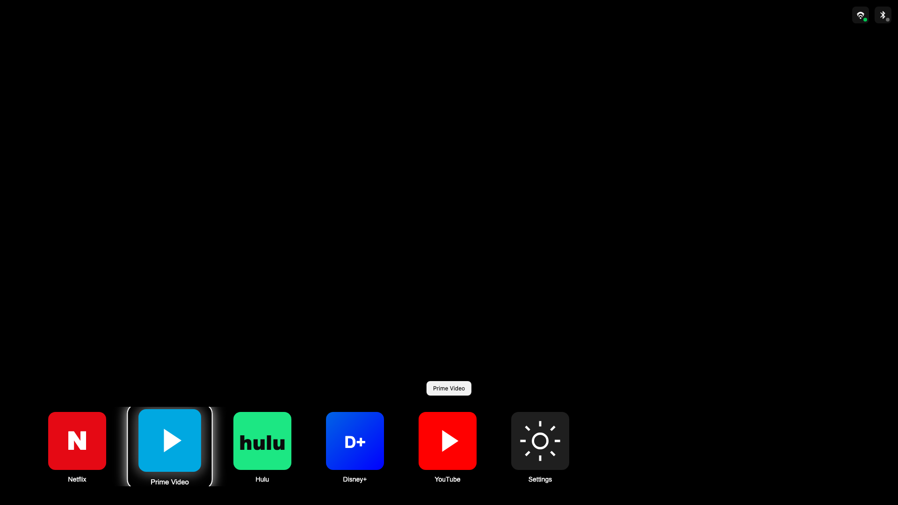
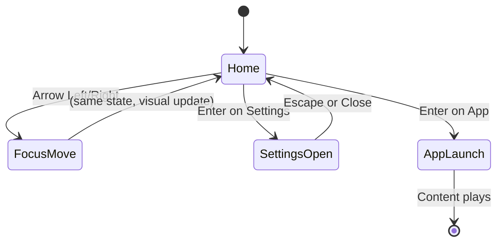

# UI Wireframes and User Journey

**Version:** 1.1  
**Date:** February 2025  
**Product:** Portable HDMI Streaming Device – TV Launcher UI

Screenshots below are captured from the live [HTML5 UI prototype](https://github.com/mravikanth2259/streamingDevice_HDMI/tree/main/ui-prototype) at 1920×1080.

---

## Table of Contents

1. [Wireframe Overview](#1-wireframe-overview)
2. [Display UI Screenshots](#2-display-ui-screenshots)
3. [User Journeys](#3-user-journeys)
4. [State Transitions](#4-state-transitions)
5. [Edge Cases and Error States](#5-edge-cases-and-error-states)

---

## 1. Wireframe Overview

### 1.1 Screen Dimensions

| Resolution | Dimensions | Icon Size |
|------------|------------|------------|
| 720p | 1280 × 720 | 120 px |
| 1080p | 1920 × 1080 | 160 px |
| 4K | 3840 × 2160 | 320 px |

### 1.2 UI Zones

```
┌─────────────────────────────────────────────────────┐
│ Zone A: Content / Brand area (future)               │
│         (optional logo, promotional banner)         │
├─────────────────────────────────────────────────────┤
│ Zone B: Empty / Ambient (black)                     │
│         Primary viewing area                        │
├─────────────────────────────────────────────────────┤
│ Zone C: Icon Rail (bottom 30%)                      │
│         App icons, Settings, navigation             │
├─────────────────────────────────────────────────────┤
│ Zone D: Network Status (top-right overlay)           │
│         Wi-Fi, Bluetooth indicators                 │
└─────────────────────────────────────────────────────┘
```

---

## 2. Display UI Screenshots

Screenshots captured from the live HTML prototype at 1920×1080. *To regenerate:*
`cd ui-prototype && python3 -m http.server 9999 &` then `python3 capture_screenshots.py`

### 2.1 Initial State – First Boot, Netflix Focused

**State:** Power on; home page loaded; first icon (Netflix) focused by default.


**Annotations:**
- Netflix has white 4 px border and glow
- Netflix icon scaled to 1.08×
- Tooltip "Netflix" may appear above icon
- Wi-Fi green (connected), Bluetooth gray (disconnected)

---

### 2.2 Focus Moved Right – Prime Video Focused

**State:** User pressed RIGHT; focus moved; rail scrolled left; Prime Video in focus.



**Annotations:**
- Rail has scrolled left (river effect)
- Prime Video shows focus border and glow
- Netflix now unfocused (no border, scale 1.0)

---

### 2.3 Settings Panel Open (Modal Overlay)

**State:** User pressed Enter on Settings icon (or S key); Settings modal displayed.


**Annotations:**
- Backdrop: `rgba(0,0,0,0.7)`
- Panel: dark (#111), ~360 px wide, centered
- Focus trapped inside panel; UP/DOWN to move, Enter to select, Escape to close
- Icon rail dimmed behind overlay

---

### 2.4 Network Icon Focused – Wi-Fi Tooltip (Wireframe)

**State:** User tabbed or moved focus to Wi-Fi icon; tooltip visible.

```
                                              Wi-Fi: Connected
                                              ┌──────────────────┐
                                                          [WiFi●] [BT○]
                                               ╔════╗  ▲ focus
                                               ║ 📶 ║
                                               ╚════╝
```

**Annotations:**
- Tooltip: white background, dark text
- Wi-Fi icon has focus border when focused
- Status badge (green dot) indicates connected

---

### 2.5 App Launch Flow – Transition (Wireframe)

**State:** User selected Netflix; app launching; brief transition before content.

```
                         ╔═══════════════════════════╗
                         ║  Launching Netflix...     ║
                         ║  (spinner or progress)   ║
                         ╚═══════════════════════════╝
```

---

### 2.6 State Diagram (Mermaid)



---

## 3. User Journeys

### 3.1 Journey 1: Power On → Home Page → Launch Netflix

**Goal:** User powers on the device and launches Netflix to stream content.


| Step | Action | System Response | User Feedback |
|------|--------|-----------------|---------------|
| 1 | User plugs in device and powers on | Device boots; HDMI handshake with TV | TV shows signal |
| 2 | Device sends CEC power-on (optional) | TV wakes and switches to HDMI input | TV turns on |
| 3 | Home page loads | Black screen; icon rail appears at bottom | Icons visible (see screenshot above) |
| 4 | First icon (Netflix) auto-focused | White border + glow on Netflix | Clear focus |
| 5 | User presses **Enter** | App launch triggered | Brief loading |
| 6 | Netflix session starts | Streaming content displays | Video plays |
| 7 | User presses **Back** (remote) | App exits; return to home | Home page shown |

**Detailed sub-steps for Steps 3–6:**

1. **Home page loads (3)**
   - Display HAL presents framebuffer
   - UI Service renders icon rail with icons from `layout.json`
   - Focus index = 0 (Netflix)
   - Network icons show status (Wi-Fi connected, Bluetooth disconnected)

2. **First icon focused (4)**
   - Netflix receives focus styles: 4 px white border, 12 px glow, scale 1.08
   - Tooltip "Netflix" may appear above icon (optional)
   - No scrolling; rail at initial position

3. **User presses Enter (5)**
   - Main loop routes key to UI Service
   - UI Service calls `select()` → returns focused app ID "netflix"
   - Main loop passes to App Launcher → `launch("netflix")`
   - Streaming Service starts session; Stream Pipeline opens content

4. **Netflix session starts (6)**
   - Video frames rendered to Display HAL
   - HDMI outputs to TV
   - User sees Netflix UI or content

---

### 3.2 Journey 2: Navigate Icon Row with Remote

**Goal:** User explores available apps by moving focus left and right.


| Step | Action | System Response | User Feedback |
|------|--------|-----------------|---------------|
| 1 | User on home; Netflix focused | - | - |
| 2 | User presses **Right** | Focus moves to Prime Video; rail scrolls left | Prime highlighted |
| 3 | User presses **Right** again | Focus moves to Hulu; rail scrolls left | Hulu highlighted |
| 4 | User presses **Right** repeatedly | Focus moves through Disney+, YouTube, Settings | River scroll; new icons enter |
| 5 | User at Settings; presses **Right** | No change; focus stays on Settings | No wrap |
| 6 | User presses **Left** | Focus moves to YouTube | YouTube highlighted |
| 7 | User presses **Left** repeatedly | Focus moves back toward Netflix | Rail scrolls right |
| 8 | User at Netflix; presses **Left** | No change; focus stays on Netflix | No wrap |

**Detailed sub-steps:**

1. **Focus movement (2–4)**
   - Input HAL receives RemoteKey::RIGHT
   - Main loop calls `ui->navigate(RIGHT)`
   - UI Service: `focusIndex = (focusIndex + 1) % count`
   - Rail `translateX` updated for river scroll (e.g. `-focusIndex * (iconWidth + gap)`)
   - CSS transition: 200–250 ms ease-out
   - New focused icon gets border + glow; previous loses it

2. **Edge – last icon (5)**
   - When `focusIndex === count - 1`, RIGHT does nothing (or wrap, per spec)
   - Spec says "no wrap" at end; focus stops at Settings

3. **Edge – first icon (8)**
   - When `focusIndex === 0`, LEFT does nothing
   - Focus stops at Netflix

---

### 3.3 Journey 3: Open Settings and Change Option

**Goal:** User opens Settings and navigates to an option.


| Step | Action | System Response | User Feedback |
|------|--------|-----------------|---------------|
| 1 | User focuses Settings icon | Settings has focus border + glow | Settings highlighted |
| 2 | User presses **Enter** | Settings modal opens | Overlay + panel visible |
| 3 | First item (Video/Display) focused | Cursor on first list item | Item highlighted |
| 4 | User presses **Down** | Focus moves to Network | Network highlighted |
| 5 | User presses **Down** | Focus moves to Bluetooth | Bluetooth highlighted |
| 6 | User presses **Enter** | Bluetooth settings sub-panel (future) | Sub-panel or action |
| 7 | User presses **Back** | Sub-panel closes; back to Settings list | Settings list |
| 8 | User presses **Escape** or selects Close | Modal closes | Return to home |

**Detailed sub-steps:**

1. **Open Settings (2)**
   - UI Service detects focused element is Settings
   - Modal `aria-hidden="false"`; `display: flex`
   - Focus moves to first Settings item or Close button
   - Backdrop blocks clicks on icon rail

2. **Navigate Settings list (4–5)**
   - UP/DOWN move focus within list
   - Focus trap: Tab/Escape not used; Back and Escape close
   - Each item has aria-label for screen readers

3. **Close Settings (8)**
   - User presses Escape or clicks Close
   - Modal `aria-hidden="true"`; hidden
   - Focus returns to Settings icon on rail

---

### 3.4 Journey 4: Check Wi-Fi Status via Network Icons

**Goal:** User checks connectivity by focusing network icons.

| Step | Action | System Response | User Feedback |
|------|--------|-----------------|---------------|
| 1 | User navigates focus to top-right (future: or dedicated key) | Wi-Fi icon receives focus | Wi-Fi highlighted |
| 2 | Wi-Fi icon focused | Tooltip appears: "Wi-Fi: Connected" | Status visible |
| 3 | User moves focus to Bluetooth | Bluetooth icon focused | Bluetooth highlighted |
| 4 | Bluetooth icon focused | Tooltip: "Bluetooth: Disconnected" | Status visible |
| 5 | User moves focus away | Tooltip hides | - |

**Note:** Current prototype places network icons in top-right; focus may require Tab or dedicated "status" key. TV remote typically uses D-pad; network icons could be in a secondary row or revealed via Settings.

---

### 3.5 Journey 5: Adjust Volume (CEC Passthrough)

**Goal:** User adjusts TV volume with remote while on home page.

| Step | Action | System Response | User Feedback |
|------|--------|-----------------|---------------|
| 1 | User on home page | - | - |
| 2 | User presses **Volume Up** | Main loop routes to HDMI-CEC Service | - |
| 3 | CEC Service sends `sendUserControl(VOLUME_UP)` | CEC HAL sends USER_CONTROL_PRESSED 0x41 | TV volume increases |
| 4 | User presses **Volume Down** | Same flow; 0x42 sent | TV volume decreases |
| 5 | User presses **Mute** | Same flow; 0x43 sent | TV mutes |

**Detailed sub-steps:**
- Volume keys do not change UI focus
- Main loop handles VOLUME_UP/DOWN/MUTE separately from navigation keys
- CEC commands sent directly to TV

---

## 4. State Transitions

### 4.1 State Diagram

```
                    ┌─────────────┐
                    │   BOOTING   │
                    └──────┬──────┘
                           │
                           ▼
                    ┌─────────────┐
           ┌───────▶│    HOME     │◀───────┐
           │        └──────┬──────┘        │
           │               │               │
           │     Enter      │ Enter         │ Back /
           │  on Settings   │ on App      Escape
           │               │               │
           ▼               ▼               │
    ┌─────────────┐  ┌─────────────┐        │
    │  SETTINGS   │  │  APP        │────────┘
    │  OPEN       │  │  PLAYING    │
    └─────────────┘  └─────────────┘
```

### 4.2 Focus Index and Scroll Position

| User Action | focusIndex | Scroll Direction | New Focus |
|-------------|------------|------------------|-----------|
| Right at start | 0 → 1 | Rail left | Prime |
| Right at mid | n → n+1 | Rail left | Next icon |
| Right at end | no change | - | Settings |
| Left at end | n → n-1 | Rail right | Previous |
| Left at start | no change | - | Netflix |
| Enter on app | - | - | Launch app |
| Enter on Settings | - | - | Open modal |

---

## 5. Edge Cases and Error States

### 5.1 Wireframe: No Apps Available

```
┌────────────────────────────────────────────────────────────────────────────────┐
│                                                                                 │
│                                                                                 │
│                                                                                 │
│                         No apps available                                       │
│                         Connect to network and try again                        │
│                                                                                 │
│                                                                                 │
│  [Settings]                                                    [WiFi○] [BT○]   │
│                                                                                 │
└────────────────────────────────────────────────────────────────────────────────┘
```

### 5.2 Wireframe: Connection Error (Streaming Failed)

```
┌────────────────────────────────────────────────────────────────────────────────┐
│                                                                                 │
│  ┌─────────────────────────────────────────────────────────────────────────┐  │
│  │  Could not connect to Netflix                                             │  │
│  │  Check your network connection.                                           │  │
│  │  [ Retry ]  [ Back ]                                                      │  │
│  └─────────────────────────────────────────────────────────────────────────┘  │
│                                                                                 │
│  [Netflix]  [Prime]  [Hulu]  ...                                                │
│                                                                                 │
└────────────────────────────────────────────────────────────────────────────────┘
```

### 5.3 Wireframe: Loading / Buffering

```
┌────────────────────────────────────────────────────────────────────────────────┐
│                                                                                 │
│                         Buffering... 45%                                         │
│                         ████████████░░░░░░░░                                    │
│                                                                                 │
│                                                                                 │
│  [Netflix]  [Prime]  ...  (dimmed)                                              │
│                                                                                 │
└────────────────────────────────────────────────────────────────────────────────┘
```

---

## 6. Regenerating Screenshots

```bash
cd ui-prototype
pip install playwright
playwright install chromium
python3 -m http.server 9999 &
python3 capture_screenshots.py
```

Screenshots are saved to `docs/images/`.

---

## 7. Related Documents

| Document | Description |
|----------|-------------|
| [TV_UI_Design_Spec.md](TV_UI_Design_Spec.md) | Color palette, typography, layout specs |
| [ui-prototype/](https://github.com/mravikanth2259/streamingDevice_HDMI/blob/main/ui-prototype/README.md) | Interactive HTML5 prototype |
| [Product_Requirements_Document.md](Product_Requirements_Document.md) | User stories and requirements |
