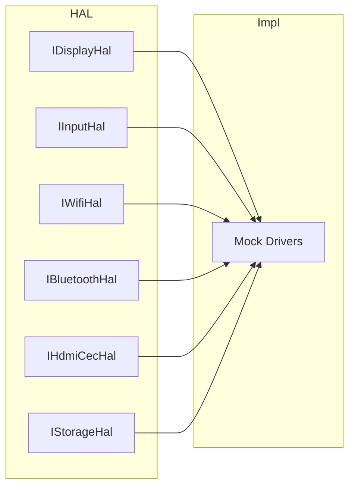

# HAL Interfaces

Hardware Abstraction Layer interfaces. Implementations are in `src/drivers/`.

## Overview



## Interfaces

| Interface | Purpose | Key Methods |
|-----------|---------|-------------|
| **IDisplayHal** | Framebuffer, HDMI output | `initialize`, `present`, `setDisplayMode`, `getFramebuffer` |
| **IInputHal** | Remote, IR, touch | `setInputCallback`, `poll`, `setEnabled` |
| **IWifiHal** | Wi-Fi client | `connect`, `disconnect`, `scan`, `resolveHost` |
| **IBluetoothHal** | A2DP, GATT | `registerControlService`, `writeCharacteristic`, `connectA2dpSink` |
| **IHdmiCecHal** | CEC to TV | `sendPowerOn`, `sendStandby`, `sendRemoteKey` |
| **IStorageHal** | Key-value store | `read`, `write`, `exists`, `remove` |
| **IPowerHal** | Sleep, wake | `enterStandby`, `wake`, `enableWakeOnRemote` |
| **IAudioHal** | HDMI/A2DP audio | `setSink`, `play`, `setVolume`, `setMute` |
| **ICodecDecoder** | Video decode | `decodeFrame`, `flush`, `reset`, `getCapabilities` |
| **IContainerParser** | Demux | `openContainer`, `readPacket`, `seek`, `getTracks` |
| **IVideoPipeline** | Color, HDR | `submitFrame`, `setHdrMetadata` |
| **IDrmHal** | Content protection | `requestKeys`, `releaseSession` |

## Factory

```cpp
auto display = hal::createDisplayHal();
auto input = hal::createInputHal();
// ... etc.
```

Factory functions in `hal_factory.cpp` and `media_hal_factory.cpp` return mock or platform implementations.
