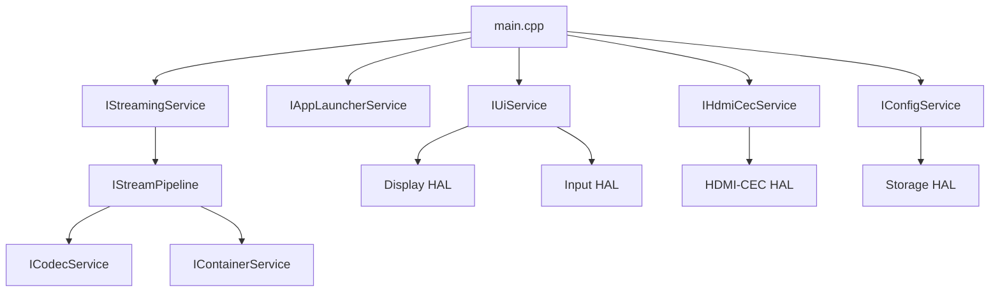

# Services

Service-oriented layer. Interfaces in `src/services/*.hpp`.

## Service Dependencies



## Service Interfaces

| Service | Purpose |
|---------|---------|
| **IUiService** | Home page, app icons, navigation |
| **IAppLauncherService** | Register apps, launch by ID |
| **IStreamingService** | Start/stop sessions, pause/resume |
| **ICodecService** | Register decoders, create for track |
| **IContainerService** | Open file, read packets, get tracks |
| **IStreamPipeline** | Demux → decode → output |
| **IHdmiCecService** | Map keys to CEC |
| **IBluetoothControlService** | Mobile app commands |
| **IConfigService** | Persistent settings |
| **ITelemetryService** | Logging |
| **IUpdateService** | OTA updates |

## Creation

```cpp
auto ui = services::createUiService();
auto launcher = services::createAppLauncherService();
// ...
```
