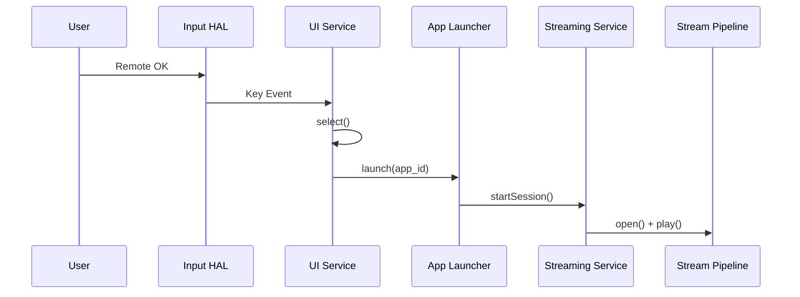
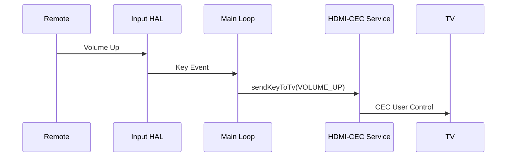
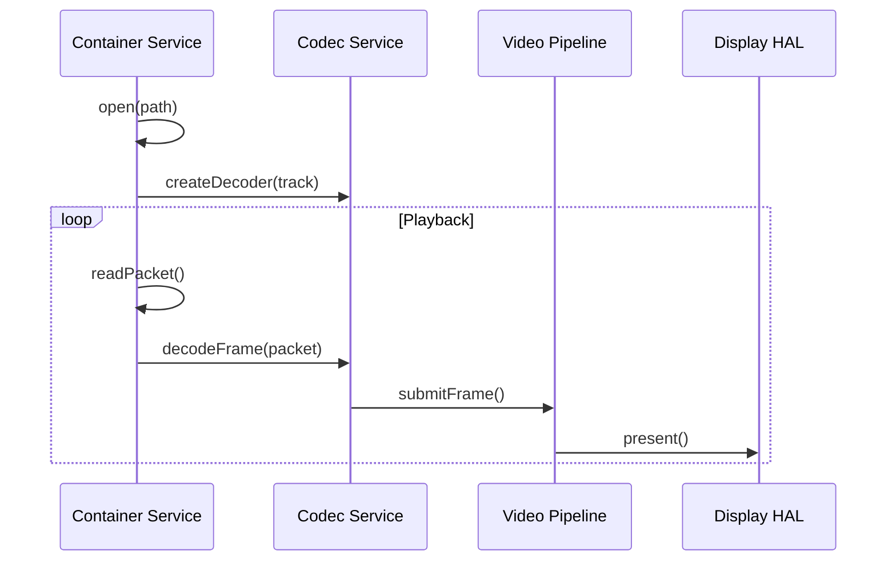

# Data Flows

Key data and control flows in the system.

## App Launch Sequence

```mermaid
sequenceDiagram
    participant U as User
    participant I as Input HAL
    participant UI as UI Service
    participant A as App Launcher
    participant S as Streaming Service
    participant P as Stream Pipeline
    
    U->>I: Remote OK
    I->>UI: Key Event
    UI->>UI: select()
    UI->>A: launch(app_id)
    A->>S: startSession()
    S->>P: open() + play()
```

## Input to CEC Flow

```mermaid
sequenceDiagram
    participant R as Remote
    participant I as Input HAL
    participant M as Main Loop
    participant CEC as HDMI-CEC Service
    participant TV as TV
    
    R->>I: Volume Up
    I->>M: Key Event
    M->>CEC: sendKeyToTv(VOLUME_UP)
    CEC->>TV: CEC User Control
```

## Streaming Pipeline Flow

```mermaid
sequenceDiagram
    participant C as Container Service
    participant D as Codec Service
    participant V as Video Pipeline
    participant H as Display HAL
    
    C->>C: open(path)
    C->>D: createDecoder(track)
    loop Playback
        C->>C: readPacket()
        C->>D: decodeFrame(packet)
        D->>V: submitFrame()
        V->>H: present()
    end
```
