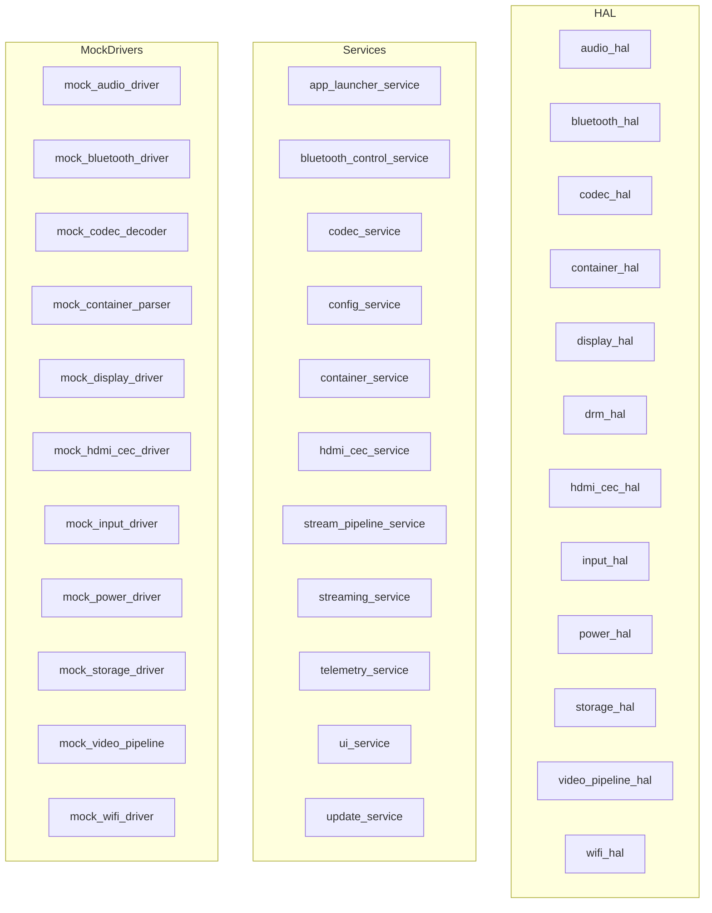

# Module Map (Auto-Generated)

> Regenerate with: `python scripts/generate_architecture.py`

## Mermaid Diagram

## HAL Modules

| Module | File |
|--------|------|
| audio_hal | audio_hal.hpp |
| bluetooth_hal | bluetooth_hal.hpp |
| codec_hal | codec_hal.hpp |
| container_hal | container_hal.hpp |
| display_hal | display_hal.hpp |
| drm_hal | drm_hal.hpp |
| hdmi_cec_hal | hdmi_cec_hal.hpp |
| input_hal | input_hal.hpp |
| power_hal | power_hal.hpp |
| storage_hal | storage_hal.hpp |
| video_pipeline_hal | video_pipeline_hal.hpp |
| wifi_hal | wifi_hal.hpp |

## Services

| Service |
|---------|
| app_launcher_service |
| bluetooth_control_service |
| codec_service |
| config_service |
| container_service |
| hdmi_cec_service |
| stream_pipeline_service |
| streaming_service |
| telemetry_service |
| ui_service |
| update_service |

## Mock Drivers

| Driver |
|--------|
| mock_audio_driver |
| mock_bluetooth_driver |
| mock_codec_decoder |
| mock_container_parser |
| mock_display_driver |
| mock_hdmi_cec_driver |
| mock_input_driver |
| mock_power_driver |
| mock_storage_driver |
| mock_video_pipeline |
| mock_wifi_driver |