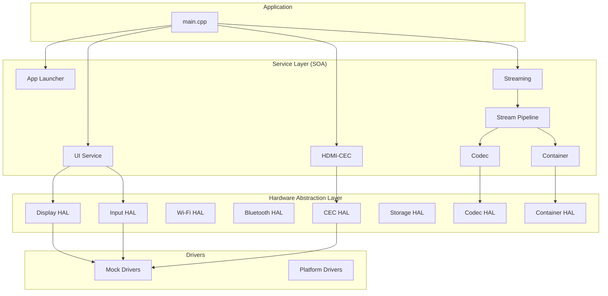

# Architecture Overview

The streaming device firmware uses a **three-layer architecture**: Application → Services (SOA) → HAL (Hardware Abstraction Layer) → Drivers.

## Layer Diagram

## Design Principles

1. **HAL** – All hardware access via abstract interfaces; platform drivers implement them.
2. **SOA** – Services communicate via event bus; clear boundaries.
3. **Testability** – Mock drivers allow unit tests without hardware.
4. **Extensibility** – New apps, codecs, and platforms via config and factories.

## Related

- [System Diagram](system-diagram.md)
- [Data Flows](data-flows.md)
- [Module Map](module-map.md)
