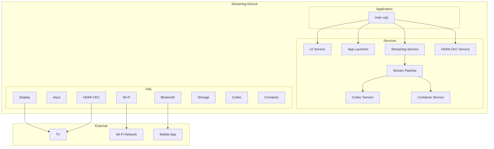
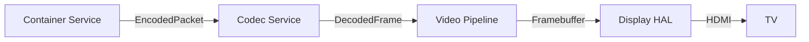
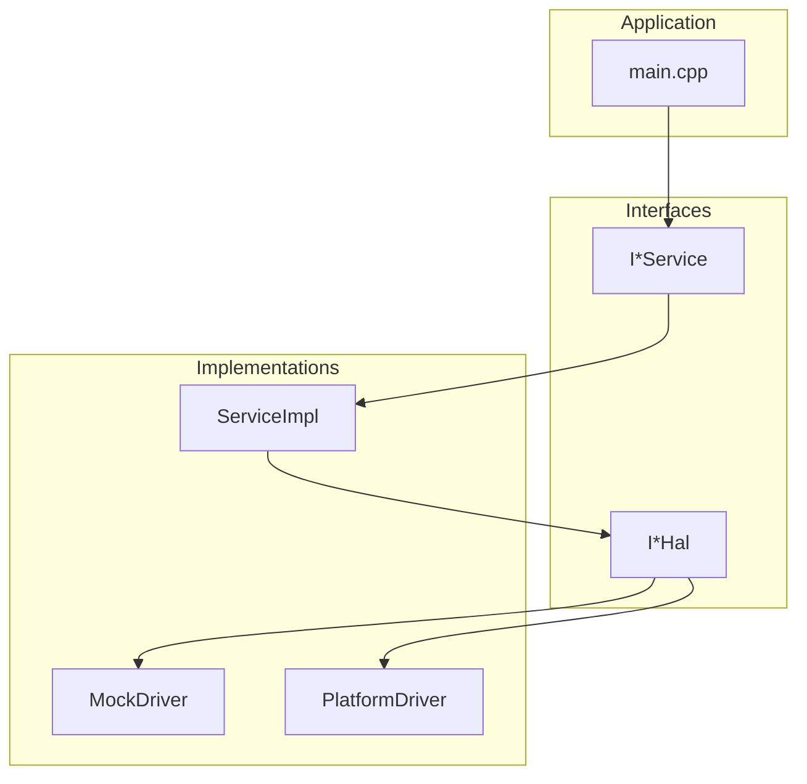

# System Diagram

High-level block diagram of the streaming device firmware.

## Full System

```mermaid
graph TB
    subgraph Device["Streaming Device"]
        subgraph AppLayer["Application"]
            Main[main.cpp]
        end
        
        subgraph SvcLayer["Services"]
            UI[UI Service]
            App[App Launcher]
            Stream[Streaming Service]
            CEC[HDMI-CEC Service]
            Codec[Codec Service]
            Container[Container Service]
            Pipeline[Stream Pipeline]
        end
        
        subgraph HAL["HAL"]
            D[Display]
            I[Input]
            W[Wi-Fi]
            B[Bluetooth]
            C[HDMI-CEC]
            S[Storage]
            Cd[Codec]
            Cn[Container]
        end
    end
    
    subgraph External["External"]
        TV[TV]
        Network[Wi-Fi Network]
        Mobile[Mobile App]
    end
    
    Main --> UI
    Main --> App
    Main --> Stream
    Main --> CEC
    Stream --> Pipeline
    Pipeline --> Codec
    Pipeline --> Container
    
    D --> TV
    C --> TV
    W --> Network
    B --> Mobile
```

## Media Pipeline

```mermaid
flowchart LR
    A[Container Service] -->|EncodedPacket| B[Codec Service]
    B -->|DecodedFrame| C[Video Pipeline]
    C -->|Framebuffer| D[Display HAL]
    D -->|HDMI| E[TV]
```

## Interfaces

```mermaid
flowchart TD
    subgraph App["Application"]
        Main[main.cpp]
    end
    
    subgraph Iface["Interfaces"]
        ISvc["I*Service"]
        IHAL["I*Hal"]
    end
    
    subgraph Impl["Implementations"]
        SvcImpl[ServiceImpl]
        Mock[MockDriver]
        Platform[PlatformDriver]
    end
    
    Main --> ISvc
    ISvc --> SvcImpl
    SvcImpl --> IHAL
    IHAL --> Mock
    IHAL --> Platform
```
