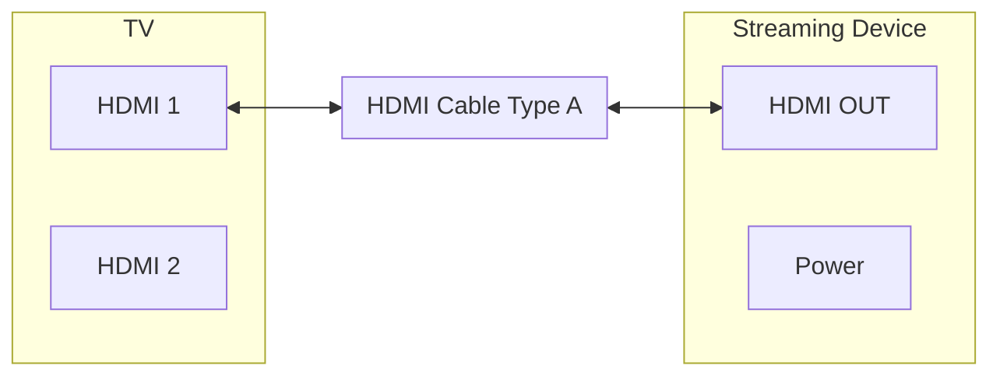

# HDMI Setup

Step-by-step instructions for connecting the streaming device to your TV.

## Connection Diagram

## Steps

| Step | Action |
|------|--------|
| 1 | Power off TV and device |
| 2 | Locate HDMI input on TV (side or back) |
| 3 | Locate **HDMI OUT** port on device |
| 4 | Connect HDMI cable: TV input ↔ device HDMI OUT |
| 5 | Connect device power (USB or DC) |
| 6 | Power on TV first, then device |
| 7 | Select HDMI input on TV (e.g., HDMI 1) |
| 8 | Enable CEC in TV settings (optional, for remote control) |

## Cable Reference

| Spec | Notes |
|------|-------|
| Connector | HDMI Type A (19-pin) |
| 1080p | HDMI 1.4+ |
| 4K HDR | HDMI 2.0+ recommended |
| Length | Standard up to ~5 m; use active/fiber for longer |

## Troubleshooting

| Issue | Solution |
|-------|----------|
| No picture | Select correct HDMI input on TV |
| No picture | Ensure cable is fully seated |
| No CEC | Enable HDMI-CEC in TV settings |
| Black screen | Check device output resolution |
