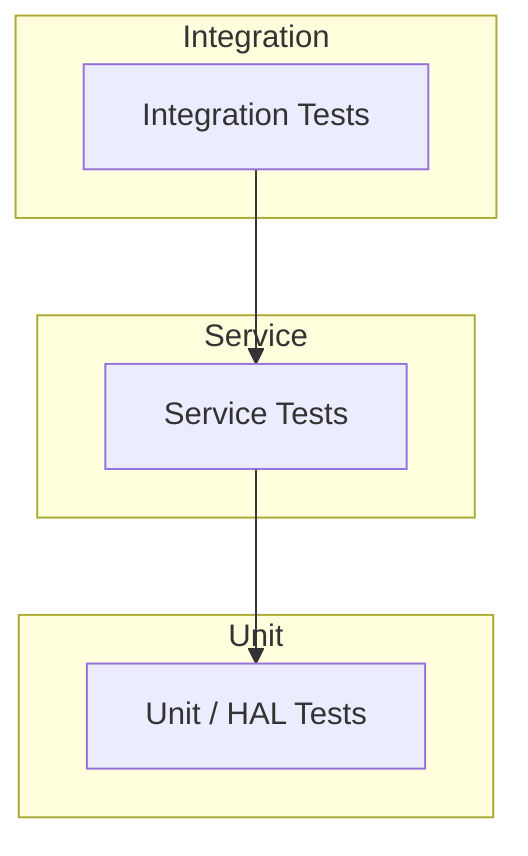

# Test Strategy

## Test Pyramid

## Layers

| Layer | Scope | Mock? |
|-------|-------|-------|
| **Unit** | HAL, drivers | N/A (drivers are mocks) |
| **Service** | Business logic | Yes (mock HAL) |
| **Integration** | End-to-end flows | Yes |

## Test Runner

Single binary: `streaming_device_tests`. Runs:

- HAL tests (Display, Input, Storage)
- Service tests (App Launcher, UI, Config)
- HDMI-CEC tests
- Codec & Container tests
- Bluetooth control tests
